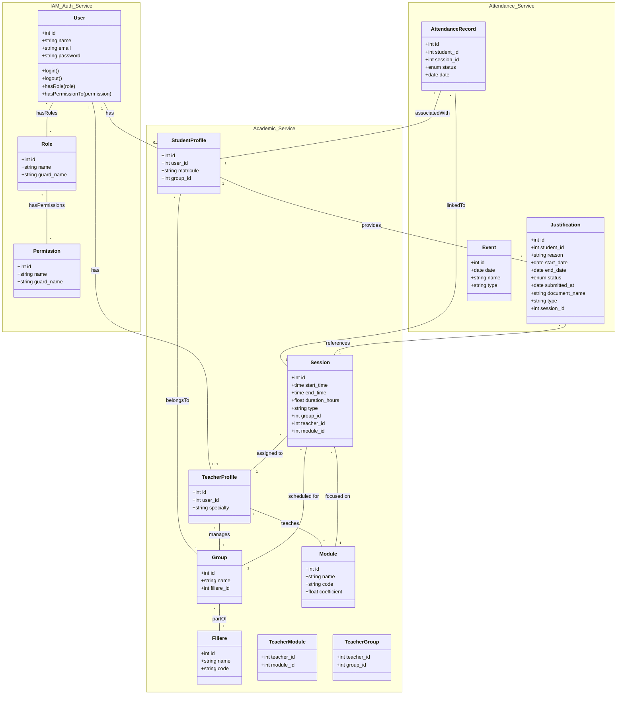

# 📊 Diagramme de Classe & Architecture Technique : AttendanceFlow-AMS

Ce document présente l'architecture technique détaillée et le diagramme de classes du système de gestion des absences (AMS). L'architecture est pensée autour des principes de **Microservices**, propulsée par **Laravel**, sécurisée avec **Spatie Permission**, et dotée d'un front-end interactif usant de **Tailwind CSS** et **Alpine.js**.

## 🏗️ Architecture Globale (Microservices & Frontend)

- **Frontend (UI Layer)** : Construit en Blade avec un design système en **Tailwind CSS** pour l'interface réactive, et **Alpine.js** pour l'interactivité légère côté client.
- **Microservices (Backend / API Layer)** : 
  - **Auth & IAM Service** : Gère l'authentification et les autorisations (intégré avec Spatie).
  - **Academic Service** : Gère les filières, groupes, modules et **sessions dynamiques**.
  - **Attendance Service** : Gère les pointages d'absences et les justifications.
- **Base de données** : Relations inter-services modélisées.

## 📌 Diagramme de Classe détaillé



## 🔄 Sessions Dynamiques (Changeables)

### Concept
Les sessions dans AttendanceFlow-AMS sont **dynamiques et configurables**, contrairement à des créneaux fixes (matin/midi/après-midi). Chaque session est créée avec des paramètres spécifiques :

### Caractéristiques des Sessions Dynamiques

| Champ | Description | Exemple |
|-------|-------------|---------|
| `id` | Identifiant unique | 1, 2, 3... |
| `start_time` | Heure de début configurable | 09:00, 11:00, 14:00 |
| `end_time` | Heure de fin configurable | 11:00, 14:00, 17:00 |
| `duration_hours` | Durée calculée (end - start) | 2.0, 3.0 heures |
| `type` | Type de cours | lecture, td, tp |
| `group_id` | Groupe concerné | 1 (10A), 2 (10B) |
| `teacher_id` | Enseignant assigné | 1 (Imane Bouziane) |
| `module_id` | Module enseigné | 1 (Web Development) |

### Avantages des Sessions Dynamiques

1. **Flexibilité** : Pas de créneaux fixes imposés
2. **Personnalisation** : Chaque groupe peut avoir son propre emploi du temps
3. **Multi-modules** : Un enseignant peut enseigner plusieurs modules
4. **Types variés** : Cours magistral (lecture), TD, TP
5. **Durées variables** : Sessions de 2h, 3h ou plus

### Exemple d'Emploi du Temps Dynamique

```
Groupe 10A (Teacher: Imane Bouziane)
├── Lundi:   09:00-11:00  Web Development (lecture)
├── Lundi:   11:00-14:00  Mobile Development (td)
├── Mardi:   09:00-11:00  Web Development (tp)
└── Mercredi: 14:00-17:00  Database Systems (lecture)

Groupe 10B (Teacher: Imane Bouziane)
├── Lundi:   09:00-11:00  Mobile Development (lecture)
├── Mardi:   11:00-14:00  Web Development (td)
└── Jeudi:   09:00-12:00  Web Development (tp)
```

### Relations Impliquées

```
Session ──── Group (scheduled for)
     │
     ├─── TeacherProfile (assigned to)
     │
     └─── Module (focused on)

TeacherProfile ──── Module (teaches via TeacherModule)
     │
     └─── Group (manages via TeacherGroup)
```

## 🛠️ Choix Technologiques

1. **Laravel (Core & API)** : 
   - Utilisation d'Eloquent ORM pour la modélisation des entités décrites ci-dessus.
   - Les relations complexes (comme `User` avec `Role`, de Many-to-Many via pivot partagés par Spatie) sont nativement supportées.
2. **Spatie Laravel Permission** :
   - L'attribut `role` string basique est remplacé par le modèle relationnel Spatie.
   - Permet une flexibilité maximale où l'Admin, le Teacher et le Student sont de simples `Users` auxquels un `Role` est assigné via la base de données sans redondance structurelle stricte de classe.
3. **Approche Microservices / Modulaire** :
   - Modélisé via les `namespaces` sur le diagramme pour isoler l'identité (`IAM_Auth_Service`), la scolarité (`Academic_Service`) et les présences (`Attendance_Service`). Ces domaines peuvent être de simples modules d'une application monolithique avec Laravel Modules ou de vrais microservices.
4. **Alpine.js & TailwindCSS** :
   - Ils n'apparaissent pas sur le diagramme de *classe du domaine backend* présenté ci-dessus car ils gèrent la **couche Vue**. 
   - Les composants Alpine invoqueront des APIs Laravel ou masqueront/afficheront des éléments UI (Tailwind classes) basé sur les Permissions Spatie réinjectées en variables Blade.
5. **Sessions Dynamiques** :
   - Implémentées dans `data.js` avec des helpers pour calculer les statuts (completed, active, upcoming)
   - Permettent une gestion flexible des emplois du temps par groupe/enseignant/module
