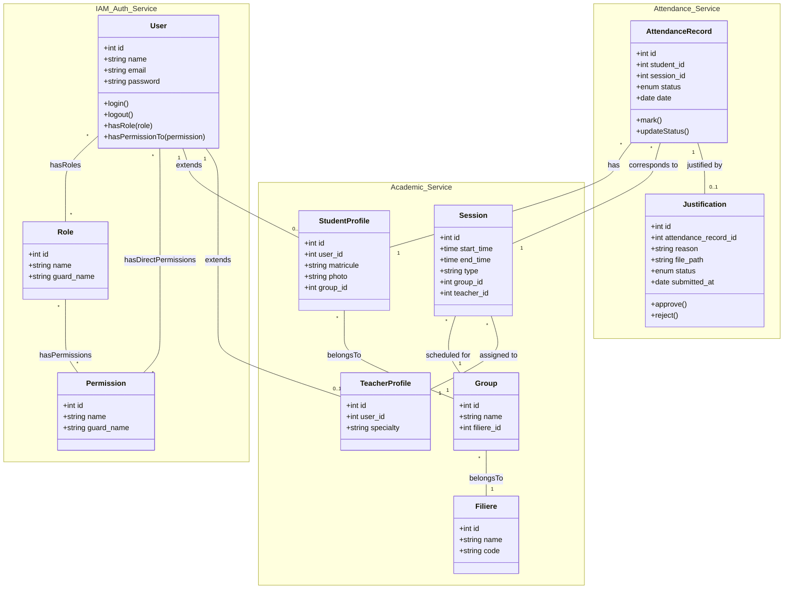

# 📊 Diagramme de Classe & Architecture Technique : AttendanceFlow-AMS

Ce document présente l'architecture technique détaillée et le diagramme de classes du système de gestion des absences (AMS). L'architecture est pensée autour des principes de **Microservices**, propulsée par **Laravel**, sécurisée avec **Spatie Permission**, et dotée d'un front-end interactif usant de **Tailwind CSS** et **Alpine.js**.

## 🏗️ Architecture Globale (Microservices & Frontend)

- **Frontend (UI Layer)** : Construit en Blade avec un design système en **Tailwind CSS** pour l'interface réactive, et **Alpine.js** pour l'interactivité légère côté client.
- **Microservices (Backend / API Layer)** : 
  - **Auth & IAM Service** : Gère l'authentification et les autorisations (intégré avec Spatie).
  - **Academic Service** : Gère les filières, groupes et sessions.
  - **Attendance Service** : Gère les pointages d'absences et les justifications.
- **Base de données** : Relations inter-services modélisées.

## 📌 Diagramme de Classe détaillé

## 🛠️ Choix Technologiques

1. **Laravel (Core & API)** : 
   - Utilisation d'Eloquent ORM pour la modélisation des entités décrites ci-dessus.
   - Les relations complexes (comme `User` avec `Role`, de Many-to-Many via pivot partagés par Spatie) sont nativement supportées.
2. **Spatie Laravel Permission** :
   - L'attribut `role` string basique est remplacé par le modèle relationnel Spatie.
   - Permet une flexibilité maximale où l'Admin, le Teacher et le Student sont de simples `Users` auxquels un `Role` est assigné via la base de données sans redondance structurelle stricte de classe.
3. **Approche Microservices / Modulaire** :
   - Modélisé via les `namespaces` sur le diagramme pour isoler l'identité (`IAM_Auth_Service`), la scolarité (`Academic_Service`) et les présences (`Attendance_Service`). Ces domaines peuvent être de simples modules d'une application monolithique avec Laravel Modules ou de vrais microservices.
4. **Alpine.js & TailwindCSS** :
   - Ils n'apparaissent pas sur le diagramme de *classe du domaine backend* présenté ci-dessus car ils gèrent la **couche Vue**. 
   - Les composants Alpine invoqueront des APIs Laravel ou masqueront/afficheront des éléments UI (Tailwind classes) basé sur les Permissions Spatie réinjectées en variables Blade.
