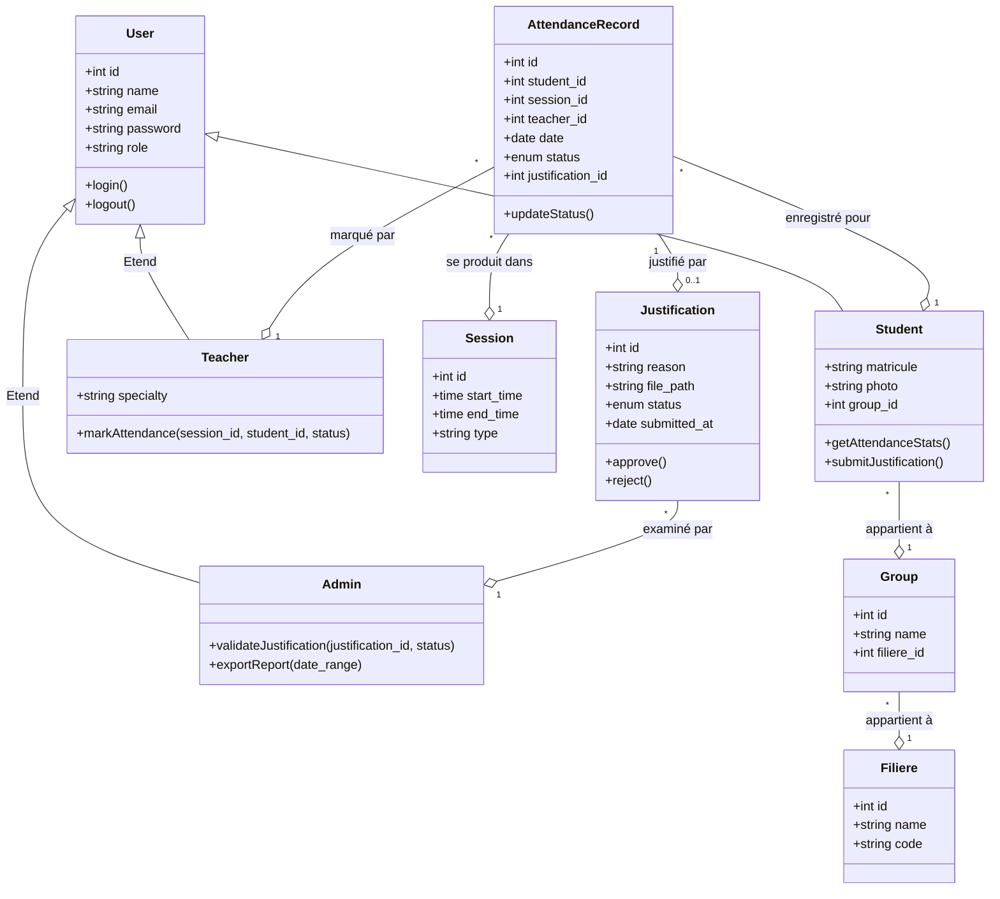

# 📊 Diagramme de Classe : AttendanceFlow-AMS

Ce diagramme représente la structure technique du système de gestion des absences (AMS).

```mermaid
classDiagram
    class User {
        +int id
        +string name
        +string email
        +string password
        +string role
        +login()
        +logout()
    }

    class Student {
        +string matricule
        +string photo
        +int group_id
        +getAttendanceStats()
        +submitJustification()
    }

    class Teacher {
        +string specialty
        +markAttendance(session_id, student_id, status)
    }

    class Admin {
        +validateJustification(justification_id, status)
        +exportReport(date_range)
    }

    class Group {
        +int id
        +string name
        +int filiere_id
    }

    class Filiere {
        +int id
        +string name
        +string code
    }

    class Session {
        +int id
        +time start_time
        +time end_time
        +string type
    }

    class AttendanceRecord {
        +int id
        +int student_id
        +int session_id
        +int teacher_id
        +date date
        +enum status
        +int justification_id
        +updateStatus()
    }

    class Justification {
        +int id
        +string reason
        +string file_path
        +enum status
        +date submitted_at
        +approve()
        +reject()
    }

    %% Relations
    User <|-- Student : Etend
    User <|-- Teacher : Etend
    User <|-- Admin : Etend

    Student "*" --o "1" Group : appartient à
    Group "*" --o "1" Filiere : appartient à

    AttendanceRecord "*" --o "1" Student : enregistré pour
    AttendanceRecord "*" --o "1" Session : se produit dans
    AttendanceRecord "*" --o "1" Teacher : marqué par
    
    AttendanceRecord "1" --o "0..1" Justification : justifié par
    Justification "*" --o "1" Admin : examiné par
```
