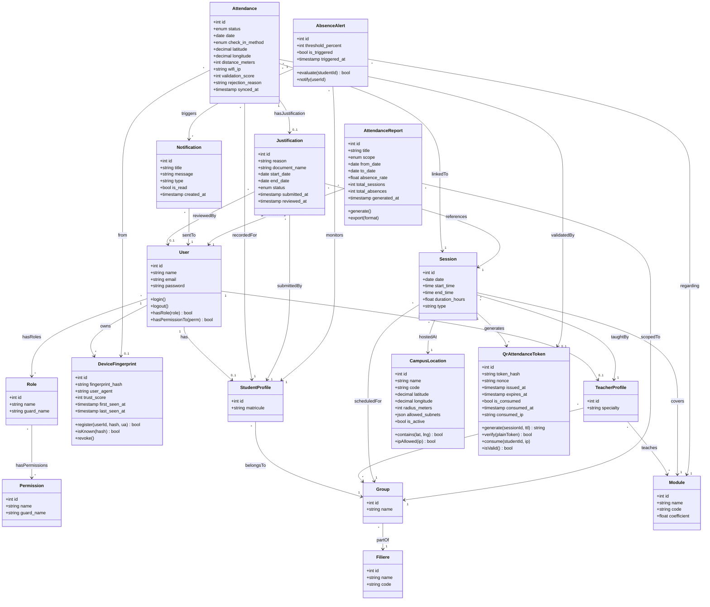

# 📊 Diagramme de Classe & Architecture Technique : AttendanceFlow-AMS

Ce document présente l'architecture technique détaillée et le diagramme de classes du système de gestion des absences (AMS). L'architecture est pensée autour des principes de **Microservices**, propulsée par **Laravel**, sécurisée avec **Spatie Permission**, et dotée d'un front-end interactif usant de **Tailwind CSS** et **Alpine.js**.

## 🏗️ Architecture Globale (Microservices & Frontend)

- **Frontend (UI Layer)** : Construit en Blade avec un design système en **Tailwind CSS** pour l'interface réactive, et **Alpine.js** pour l'interactivité légère côté client.
- **Microservices (Backend / API Layer)** :
  - **Auth & IAM Service** : Gère l'authentification et les autorisations (intégré avec Spatie).
  - **Academic Service** : Gère les filières, groupes, modules et **sessions dynamiques**.
  - **Attendance Service** : Gère les pointages d'absences et les justifications.
  - **QR Attendance Service** : Génération/vérification de tokens HMAC, validation multi-facteur (géofencing, Wi-Fi campus, empreinte appareil), file d'attente hors-ligne.
- **Base de données** : Relations inter-services modélisées.

## 📌 Diagramme de Classe détaillé (Corrigé)


```mermaid
classDiagram

class User {
    +int id
    +string name
    +string email
    +string password
    +login()
    +logout()
    +hasRole(role) bool
    +hasPermissionTo(perm) bool
}

class Role {
    +int id
    +string name
    +string guard_name
}

class Permission {
    +int id
    +string name
    +string guard_name
}

class DeviceFingerprint {
    +int id
    +string fingerprint_hash
    +string user_agent
    +int trust_score
    +timestamp first_seen_at
    +timestamp last_seen_at
    +register(userId, hash, ua) bool
    +isKnown(hash) bool
    +revoke()
}

class StudentProfile {
    +int id
    +string matricule
}

class TeacherProfile {
    +int id
    +string specialty
}

class Group {
    +int id
    +string name
}

class Filiere {
    +int id
    +string name
    +string code
}

class Module {
    +int id
    +string name
    +string code
    +float coefficient
}

class CampusLocation {
    +int id
    +string name
    +string code
    +decimal latitude
    +decimal longitude
    +int radius_meters
    +json allowed_subnets
    +bool is_active
    +contains(lat, lng) bool
    +ipAllowed(ip) bool
}

class Session {
    +int id
    +date date
    +time start_time
    +time end_time
    +float duration_hours
    +string type
}

class Attendance {
    +int id
    +enum status
    +date date
    +enum check_in_method
    +decimal latitude
    +decimal longitude
    +int distance_meters
    +string wifi_ip
    +int validation_score
    +string rejection_reason
    +timestamp synced_at
}

class QrAttendanceToken {
    +int id
    +string token_hash
    +string nonce
    +timestamp issued_at
    +timestamp expires_at
    +bool is_consumed
    +timestamp consumed_at
    +string consumed_ip
    +generate(sessionId, ttl) string
    +verify(plainToken) bool
    +consume(studentId, ip)
    +isValid() bool
}

class Justification {
    +int id
    +string reason
    +string document_name
    +date start_date
    +date end_date
    +enum status
    +timestamp submitted_at
    +timestamp reviewed_at
}

class Notification {
    +int id
    +string title
    +string message
    +string type
    +bool is_read
    +timestamp created_at
}

class AttendanceReport {
    +int id
    +string title
    +enum scope
    +date from_date
    +date to_date
    +float absence_rate
    +int total_sessions
    +int total_absences
    +timestamp generated_at
    +generate()
    +export(format)
}

class AbsenceAlert {
    +int id
    +int threshold_percent
    +bool is_triggered
    +timestamp triggered_at
    +evaluate(studentId) bool
    +notify(userId)
}

User "1" --> "0..1" StudentProfile : has
User "1" --> "0..1" TeacherProfile : has
User "*" --> "*" Role : hasRoles
Role "*" --> "*" Permission : hasPermissions
User "1" --> "*" DeviceFingerprint : owns

StudentProfile "*" --> "1" Group : belongsTo
Group "*" --> "1" Filiere : partOf
TeacherProfile "*" --> "*" Module : teaches
TeacherProfile "*" --> "*" Group : manages
Session "*" --> "1" Group : scheduledFor
Session "*" --> "1" TeacherProfile : taughtBy
Session "*" --> "1" Module : covers
Session "*" --> "1" CampusLocation : hostedAt

Session "1" --> "*" QrAttendanceToken : generates
Attendance "*" --> "1" StudentProfile : recordedFor
Attendance "*" --> "1" Session : linkedTo
Attendance "*" --> "0..1" QrAttendanceToken : validatedBy
Attendance "*" --> "0..1" DeviceFingerprint : from
Attendance "1" --> "0..1" Justification : hasJustification
Justification "*" --> "1" StudentProfile : submittedBy
Justification "*" --> "1" Session : references
Justification "*" --> "0..1" User : reviewedBy

AbsenceAlert "*" --> "1" StudentProfile : monitors
AbsenceAlert "*" --> "1" Module : regarding
AbsenceAlert "1" --> "*" Notification : triggers
Notification "*" --> "1" User : sentTo

AttendanceReport "*" --> "1" Group : scopedTo
AttendanceReport "*" --> "1" User : generatedBy
```

---

## ✅ Changements effectués sur le diagramme de classes

| # | Changement | Raison |
|---|-----------|--------|
| 1 | `AttendanceRecord` → `Attendance` | Nom plus standard et court |
| 2 | Ajout de `date` dans `Session` | Une session a une date précise (indispensable) |
| 3 | Suppression de `justification_id` dans `Attendance` | Remplacé par une relation directe `Attendance * -- 0..1 Justification` |
| 4 | Suppression de `session_id` dans `Justification` | Redondant car la relation `Justification * -- 1 Session` existe déjà |
| 5 | `reviewed_by` (int) → relation `Justification * -- 0..1 User` | Un justificatif est revu par un utilisateur, pas un simple ID |
| 6 | Ajout de `user_id` dans `Notification` | Explicit dans l'attribut plutôt que implicite via la relation |
| 7 | Suppression de `qr_token_id` et `device_fingerprint_id` de `Attendance` | Remplacés par les relations directes `Attendance * -- 0..1 QrAttendanceToken` et `DeviceFingerprint` |
| 8 | Ajout relation `Attendance * -- 0..1 Justification : justifiedBy` | Lien direct entre une présence et sa justification |
| 9 | `CampusLocation -- Session : hosted at` → `hosts` | Verbe plus clair, relation correcte |
| 10 | Suppression `consumed_by_student_id` de `QrAttendanceToken` | Remplacé par relation via `Attendance` (le token est lié à l'étudiant consommateur via Attendance) |

## 🔄 Sessions Dynamiques (Changeables)

### Concept
Les sessions dans AttendanceFlow-AMS sont **dynamiques et configurables**, contrairement à des créneaux fixes (matin/midi/après-midi). Chaque session est créée avec des paramètres spécifiques :

### Caractéristiques des Sessions Dynamiques

| Champ | Description | Exemple |
|-------|-------------|---------|
| `id` | Identifiant unique | 1, 2, 3... |
| `start_time` | Heure de début configurable | 09:00, 11:00, 14:00 |
| `end_time` | Heure de fin configurable | 11:00, 14:00, 17:00 |
| `duration_hours` | Durée calculée (end - start) | 2.0, 3.0 heures |
| `type` | Type de cours | lecture, td, tp |

### Avantages des Sessions Dynamiques

1. **Flexibilité** : Pas de créneaux fixes imposés
2. **Personnalisation** : Chaque groupe peut avoir son propre emploi du temps
3. **Multi-modules** : Un enseignant peut enseigner plusieurs modules
4. **Types variés** : Cours magistral (lecture), TD, TP
5. **Durées variables** : Sessions de 2h, 3h ou plus

### Exemple d'Emploi du Temps Dynamique

```
Groupe 10A (Teacher: Imane Bouziane)
├── Lundi:   09:00-11:00  Web Development (lecture)
├── Lundi:   11:00-14:00  Mobile Development (td)
├── Mardi:   09:00-11:00  Web Development (tp)
└── Mercredi: 14:00-17:00  Database Systems (lecture)

Groupe 10B (Teacher: Imane Bouziane)
├── Lundi:   09:00-11:00  Mobile Development (lecture)
├── Mardi:   11:00-14:00  Web Development (td)
└── Jeudi:   09:00-12:00  Web Development (tp)
```

### Relations Impliquées

```
Session ──── Group (scheduled for)
     │
     ├─── TeacherProfile (assigned to)
     │
     └─── Module (focused on)

TeacherProfile ──── Module (teaches)
     │
     └─── Group (manages)
```

## 🔐 Pointage QR Code — Pipeline de validation

### Vue d'ensemble

Le système de pointage QR remplace/augmente la saisie manuelle par un scan dynamique côté étudiant (app mobile NativePHP) avec validation multi-facteur côté serveur.

### Flux de pointage

```
┌─────────────────┐         ┌──────────────────┐         ┌─────────────────┐
│  TEACHER (Web)  │         │  MOBILE APP      │         │  LARAVEL API    │
│                 │         │  (NativePHP)     │         │                 │
│ 1. Ouvre session│         │                  │         │                 │
│    QR display   │         │                  │         │                 │
│       │         │         │                  │         │                 │
│       ▼         │         │                  │         │                 │
│ GET /api/.../token        │                  │         │                 │
│       ────────────────────► QrTokenService ──►         │                 │
│       ◄────────────────────  {token, qr_png}          │                 │
│       │         │         │                  │         │                 │
│ Affiche QR (30s)│         │                  │         │                 │
│ (refresh 25s)   │         │                  │         │                 │
│                 │         │ 2. Scan QR       │         │                 │
│                 │         │    + get GPS     │         │                 │
│                 │         │    + get device_fp│         │                 │
│                 │         │       │          │         │                 │
│                 │         │       ▼          │         │                 │
│                 │         │ POST /api/.../scan────────►                 │
│                 │         │                  │         │                 │
│                 │         │                  │ 3. QrTokenService.verify()│
│                 │         │                  │ 4. GeolocationService     │
│                 │         │                  │ 5. WifiSubnetService      │
│                 │         │                  │ 6. DeviceFingerprint      │
│                 │         │                  │ 7. ValidationScoreService│
│                 │         │                  │    → present/late/rejected│
│                 │         │ ◄────────────────────  Response {status}     │
│                 │         │ Toast ✅/⚠️/❌    │         │                 │
│                 │         │                  │         │ 8. MarkAttendance │
│                 │         │                  │         │ 9. Notification  │
└─────────────────┘         └──────────────────┘         └─────────────────┘
```

### Stratégie de validation (score-based)

| Signal | Poids | Binaire/Scoring |
|---|---|---|
| **HMAC signature** | obligatoire | HMAC valide = score 100 / invalide = rejected |
| **Géolocalisation** | 40 pts | Distance Haversine ≤ 50m + accuracy ≤ 100m |
| **Wi-Fi campus** | 30 pts | IP client dans `192.168.10.0/24` ou `10.190.0.0/16` |
| **Empreinte appareil** | 30 pts | Fingerprint connu pour cet utilisateur |

Seuils :
- `score ≥ 70` → `present`
- `40 ≤ score < 70` → `late`
- `score < 40` → `rejected` (notification au teacher)

### Format du token QR (HMAC-SHA256)

```
Payload (base64url):
{
  "sid":  42,            // session id
  "n":    "9c1f...",     // nonce (16 bytes random)
  "iat":  1718456400,    // issued_at
  "exp":  1718456430     // expires_at (iat + 30s)
}

Signed:
  payload_b64 + "." + hmac_sha256(payload_b64, QR_HMAC_SECRET)

Clock skew tolerance: ±60s
```

### File d'attente hors-ligne

Les scans effectués sans réseau sont stockés en SQLite local sur l'app mobile avec :
- `client_timestamp` (horodatage local)
- `nonce` (idempotence : rejet des doublons)
- `attempts` (retry counter)
- Sync au retour réseau via `POST /api/attendance/qr/sync-offline` (batch ≤ 50)
- Rejet des scans > 24h

### Override manuel (formateur)

Le formateur peut forcer un statut **après** la session via l'UI web existante (`attendance/show.blade.php` radio buttons). Cette action :
- Met à jour `check_in_method = 'manual'`
- Conserve l'historique (champ `validation_score` non écrasé)
- Déclenche une notification à l'étudiant

## 🛠️ Choix Technologiques

1. **Laravel (Core & API)** : 
   - Utilisation d'Eloquent ORM pour la modélisation des entités décrites ci-dessus.
   - Les relations complexes (comme `User` avec `Role`, de Many-to-Many via pivot partagés par Spatie) sont natives.
2. **Spatie Laravel Permission** :
   - L'attribut `role` string basique est remplacé par le modèle relationnel Spatie.
   - Permet une flexibilité maximale où l'Admin, le Teacher et le Student sont de simples `Users` auxquels un `Role` est assigné via la base de données sans redondance structurelle stricte de classe.
3. **Approche Microservices / Modulaire** :
   - Modélisé via les `namespaces` sur le diagramme pour isoler l'identité (`IAM_Auth_Service`), la scolarité (`Academic_Service`), les présences (`Attendance_Service`) et le pointage QR (`QR_Attendance_Service`).
4. **Alpine.js & TailwindCSS** :
   - Gèrent la **couche Vue** côté web.
   - L'app mobile (NativePHP/Laravel) utilise ses propres composants Blade pour le scanner.
5. **Sessions Dynamiques** :
   - Implémentées en base avec `start_time`/`end_time`/`duration_hours` calculés.
6. **Sécurité QR** :
   - HMAC-SHA256 avec secret en `.env`
   - `config/qr_attendance.php` centralise tous les paramètres (TTL, seuils, subnets, campus)
   - Score-based : dégradé gracieux si signal partiel (ex: GPS indoor)
   - Replay protection via `is_consumed` flag
