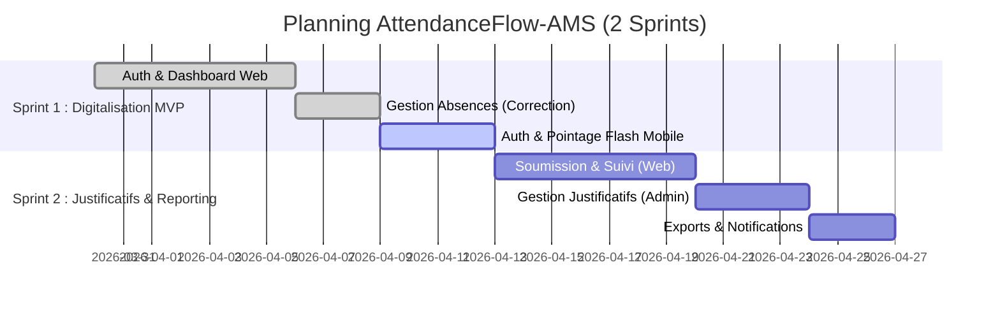

# 📅 Planification du Projet : AttendanceFlow-AMS

Ce document détaille la stratégie de gestion de projet, le découpage en Sprints et la répartition des tâches pour le développement d'**AttendanceFlow-AMS**.

---

## 🛠️ Méthodologie & Outils
- **Cadre de Travail** : Méthodologie **SCRUM** (Agile) avec 2 Sprints majeurs.
- **Gestion de Version** : GitHub avec une stratégie de branches par fonctionnalité (`feat/`).
- **Suivi des Tâches** : Basé sur les Diagrammes de Cas d'Utilisation (Sprint 1 & 2).

---

## 📅 Timeline des Sprints

---

## 📋 Détails des Sprints

### Sprint 1 : Digitalisation de Base (MVP)
*   **Objectif** : Rendre le système de pointage et de suivi de base opérationnel.
*   **Cas d'Utilisation** : `UC_W01`, `UC_W_ABS`, `UC_W03`, `UC_M01`, `UC_M02`, `UC_M02a`.
*   **Tâches** :
    - [x] **[UC_W01/M01]** Système d'authentification unifié (Laravel + API).
    - [x] **[UC_W_ABS]** Interface de gestion et correction des absences (Web).
    - [x] **[UC_W03]** Dashboard administratif en lecture seule.
    - [ ] **[UC_M02]** Système de pointage "Flash" sur Mobile.
    - [ ] **[UC_M02a]** Saisie des motifs de retard via l'interface mobile.

### Sprint 2 : Justificatifs, Reporting & Suivi
*   **Objectif** : Gérer les flux de documents et les rapports de synthèse.
*   **Cas d'Utilisation** : `UC_W04`, `UC_W05`, `UC_W06`, `UC_W07`, `UC_M08`, `UC_M03`, `UC_M07`, `UC_M09`, `UC_M10`.
*   **Tâches** :
    - [ ] **[UC_W04/M03]** Soumission numérique des justificatifs (Web & Mobile).
    - [ ] **[UC_W05/M10]** Validation/Réfutation des justificatifs par l'Admin.
    - [ ] **[UC_W06/M07]** Historique complet d'assiduité et statistiques.
    - [ ] **[UC_W07]** Moteur d'exportation de rapports (PDF/Excel).
    - [ ] **[UC_M09]** Système de notifications d'alertes d'absence.
    - [ ] **[UC_M08]** Vérification du statut de session en temps réel.

---

## 🚦 Gestion des Risques
1.  **Délai de Livraison** : Concentré sur 2 Sprints pour assurer une livraison MVP rapide.
2.  **Intégrité des Données** : Validée par le système de "Gestion avancée" dans Sprint 1.
