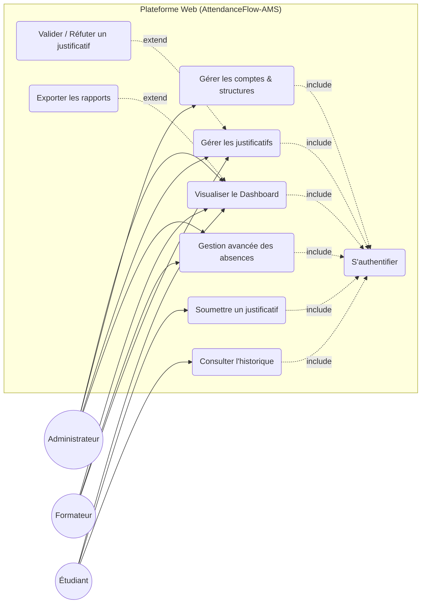
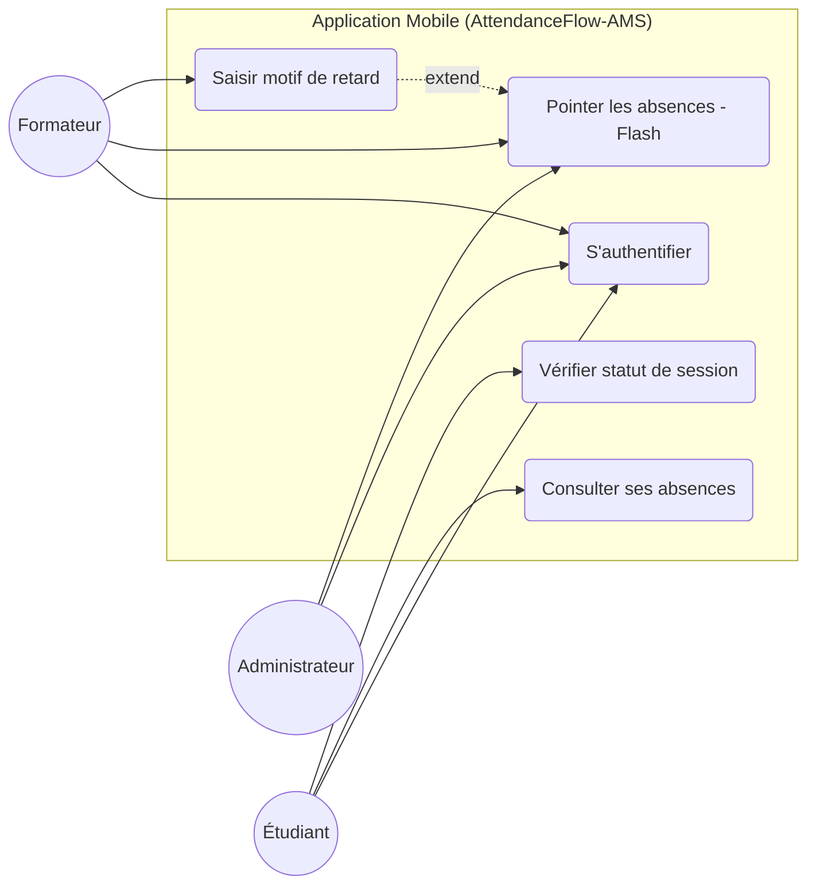
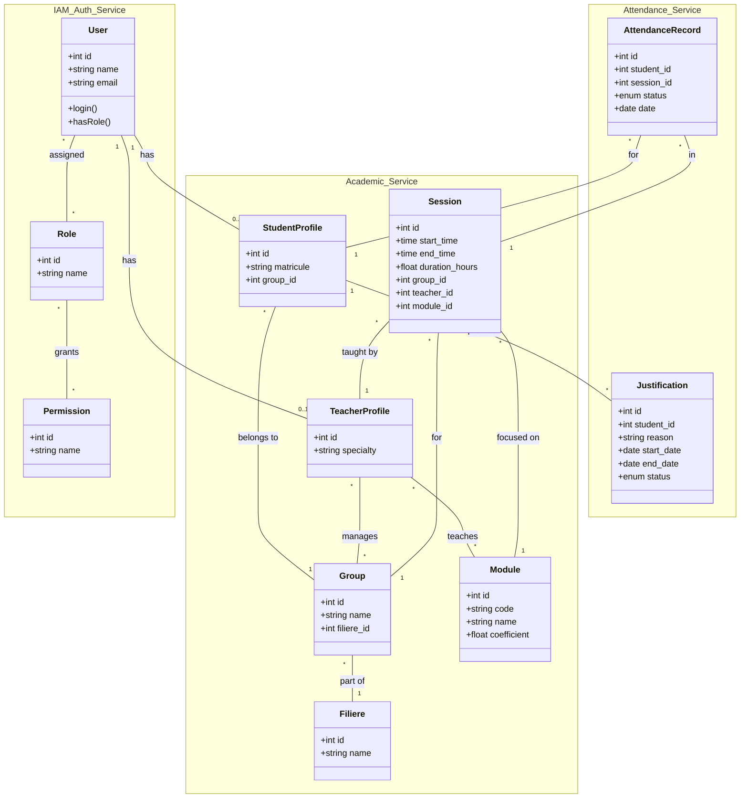

# 🎓 AttendanceFlow-AMS: Project Documentation

This document provides a comprehensive overview of the **AttendanceFlow-AMS** project, including its structure, functional use cases, and technical data model.

---

## 📁 File & Folder Structure

The project is organized to separate analysis, design, and implementation prototypes.

### 🏛️ Root Directory
*   `Analyse/`: Contains all functional and technical analysis documents.
*   `Presentation/`: Holds presentation materials and visual assets.
*   `Raport/`: Detailed final project reports.
*   `maquete/`: High-fidelity web UI prototypes (HTML/CSS).
*   `maquete-mobile/`: Mobile-first UI prototypes for field operations.
*   `README.md`: Project introduction and vision.

### 🔍 Analysis (`Analyse/`)
*   `cas_utilisation/`: UML Use Case diagrams (Global, Sprint 1, Sprint 2) for Web and Mobile.
*   `diagramme_de_classe/`: Data model and class architecture.
*   `définition_de_problème/`: Synthesis of core challenges and "How Might We" questions.
*   `Empathie/`: Mind maps and persona studies.

---

## 🎭 Use Case Diagrams

AttendanceFlow-AMS serves three primary personas: **Administrators**, **Trainers**, and **Students**.

### 🌐 Global Web Platform
Focuses on administrative management, reporting, and justification validation.

### 📱 Global Mobile Application
Optimized for rapid field operations (attendance marking and quick consultation).

---

## 📊 Class Diagram

The system uses a modular architecture separating Identity (IAM), Academic structure, and Attendance tracking.

---

## 🗄️ Implémentation de la Base de Données

Le projet utilise une architecture de base de données structurée pour gérer les utilisateurs, les profils académiques et le suivi des présences.

### Système de Test et Seeding (CSV)
Pour faciliter le développement et les tests, un système de seeding basé sur des fichiers CSV a été mis en œuvre. 

*   **Fichiers de données** : Situés dans `database/data/`.
*   **Guide de Test** : Pour les instructions détaillées sur la migration et le seeding, consultez le [DATABASE_TESTING_GUIDE.md](DATABASE_TESTING_GUIDE.md).
*   **Commande principale** : `php artisan db:seed --class=CsvSeeder`

---

## 🏗️ Architecture Modulaire (Services)

Le projet adopte une architecture orientée services (Domain-Driven Design) pour garantir la modularité et l'évolutivité. 

Pour une conception détaillée de cette architecture en services indépendants (ex: `AcademicService`, `AttendanceService`, `IdentityService`), veuillez consulter le document :
*   [**Conception de l'Architecture des Services**](ARCHITECTURE_DESIGN.md)

---

## 🛠️ Tech Stack

*   **Backend**: Laravel 12 (PHP 8.2+)
*   **Frontend**: Blade, Tailwind CSS, Alpine.js
*   **Database**: MySQL
*   **Permissions**: Spatie Laravel-Permission
*   **Methodology**: Agile (Scrum), Design Thinking
