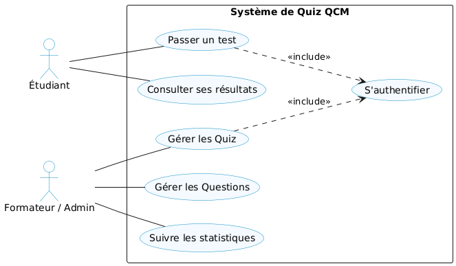
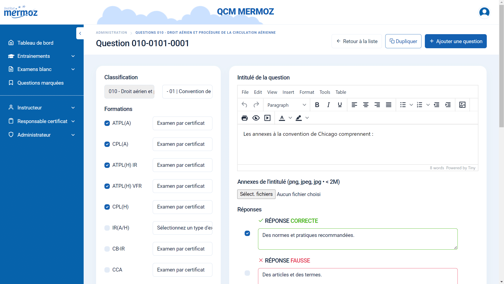
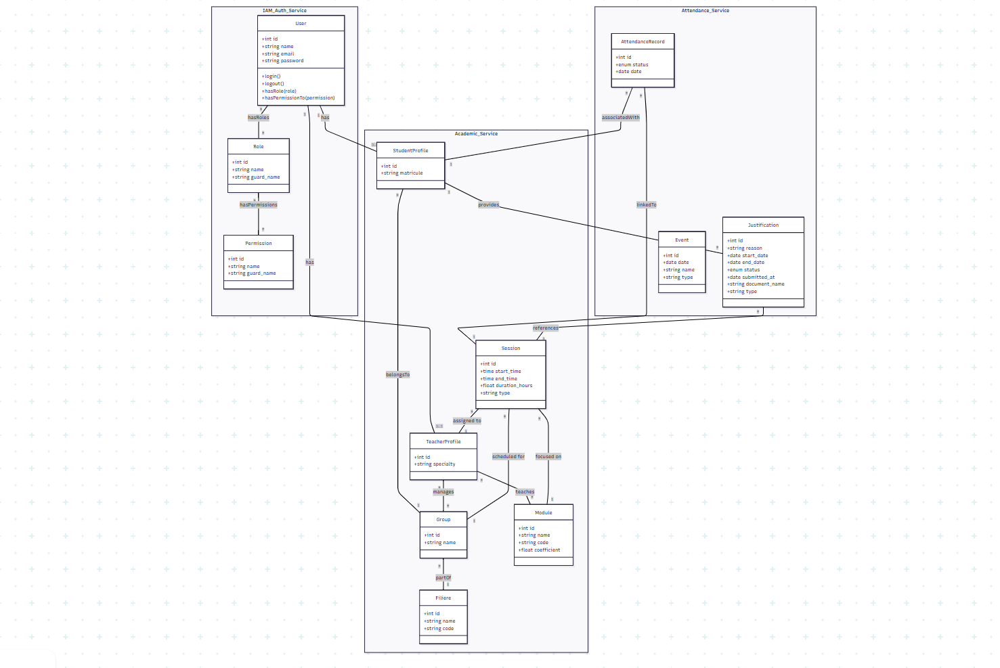

  
  

# **Projet de Fin de Formation**
### Système de QCM Interactif

**Réalisé par :** Abdelhay Mallouli  
**Encadré par :** M. ESSARRAJ Fouad  
**Filière :** Développement Mobile et Web

---

## Sommaire

  

1

Contexte du projet

  

2

Méthodologie de travail

  

3

Branche Fonctionnelle

  

4

Branche Technique

  

5

Conception

    

6

Démonstration

  

7

Conclusion

---
## 1. Contexte du projet

---

## 2. Méthodologie : Design Thinking

  

---

## Méthodologie : Scrum (Agile)

  

---

## Méthodologie : Processus 2TUP

  

---

## 3. Branche Fonctionnelle : Design Thinking
### 1. EMPATHIE

  

    <h4>Comprendre l'utilisateur</h4>
    <blockquote style="font-style: italic; background: white; padding: 15px; border-radius: 8px;">
      
- La formatrice Fatine souhaite un système simple pour créer et gérer des QCM personnalisables, avec correction automatique et affichage du score final.

      
- Le formateur Youssef souhaite un QCM structuré par session et objectif, lié au professeur, avec un calcul automatique des résultats.

      
- L’administrateur Hamouda souhaite une plateforme fiable avec des données validées, un QCM structuré et sécurisé, ainsi qu’une interface simple pour faciliter la gestion des candidats.

    </blockquote>
  

---

## Branche Fonctionnelle : Design Thinking
### 2. DÉFINITION

  

    <h4>Cadrage du problème</h4>
    <blockquote style="font-style: italic; background: white; padding: 15px; border-radius: 8px;">
     
 - Comment pourrions-nous permettre aux formateurs de générer des QCM par objectif en quelques clics, tout en garantissant une correction instantanée pour l'étudiant ? 

      
- Comment pourrions-nous structurer l'interface pour que la liaison entre une question, un professeur et un objectif de session soit totalement transparente ? 

      
-Comment pourrions-nous concevoir une interface administrateur simple, claire et ergonomique permettant une gestion efficace des candidats et des QCM ? 

    </blockquote>
  

---

## Branche Fonctionnelle : Design Thinking
### 3. IDÉATION

  

    <h4>Solutions retenues</h4>
    
• Interface <strong>"Single Question"</strong> pour éviter la surcharge cognitive.

    
• <strong>Timer dynamique</strong> par catégorie de question.

    
• <strong>Dashboard</strong> temps réel pour le suivi des formateurs.

  

---

## Branche Fonctionnelle : Cas d'utilisation

  <h3>Interaction Utilisateur (UML)</h3>
  

---
## Branche Fonctionnelle : Maquettes (UI/UX)

  

    
    
Interface Administration

  

---

## 4. Branche Technique : Tech Stack

  

    <h4>Les technologies à utiliser</h4>
    <ul>
      <li><strong>Base de données:</strong> MySQL </li>
      <li><strong>Framework:</strong> Laravel 12</li>
      <li><strong>Architecture:</strong> N-Tiers</li>
      <strong>Controller:</strong> Requêtes HTTP
      <strong>Service:</strong> Logique métier
      <strong>Model:</strong> Base de données
      <li><strong>Architecture:</strong> MVC</li>
      <li><strong> Blade :</strong>Templates réutilisables (components, layouts).</li>
    </ul>
  

  

    <ul>
      <li><strong> AJAX :</strong> Interactions dynamiques (ex: Modales) sans rechargement de page.</li>
      <li><strong>Alpine.js :</strong>  Librairie JavaScript pour les interactions dynamiques.</li>
      <li><strong>Spatie :</strong> Librairie pour la gestion des permissions et rôles.</li>
      <li><strong>Vite :</strong>   Outil de build rapide.</li>
      <li><strong>Lucide :</strong> Librairie d'icônes.</li>
      <li><strong>Tailwind CSS :</strong>Développement rapide, responsive.</li>
    </ul>
  

---

## 5. Conception : Diagramme de classe

 <h3>Modélisation des données (MLD)</h3>

 
  

---

## 5. Démonstration : Environnement & Outils

  

    <h4>Environnement de Développement</h4>
    <ul>
      <li><strong>IDE :</strong> VS Code & Antigravity </li>
      <li><strong>Monitoring DB :</strong> Workbench Sql</li>
    </ul>
  

  

    <h4>Gestion & Déploiement</h4>
    <ul>
      <li><strong>Modelisation UML :</strong>Mermaid/PlantUML</li>
      <li><strong>Gestion de version :</strong> Git (GitHub)</li>
      <li><strong>Navigateur :</strong> Chrome DevTools</li>
    </ul>
  

 

---
## 6. Conclusion

- **Objectifs atteints** : Application QCM fonctionnelle et responsive.
- **Compétences** : Maîtrise du cycle Agile et de la stack Full-stack.
- **Perspectives** : Intégration d'un module d'IA pour l'analyse prédictive.

 

### Merci pour votre attention !