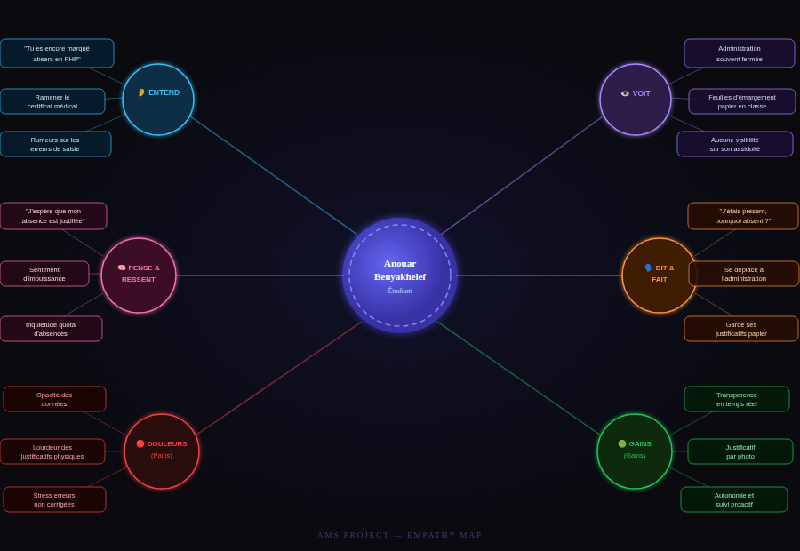
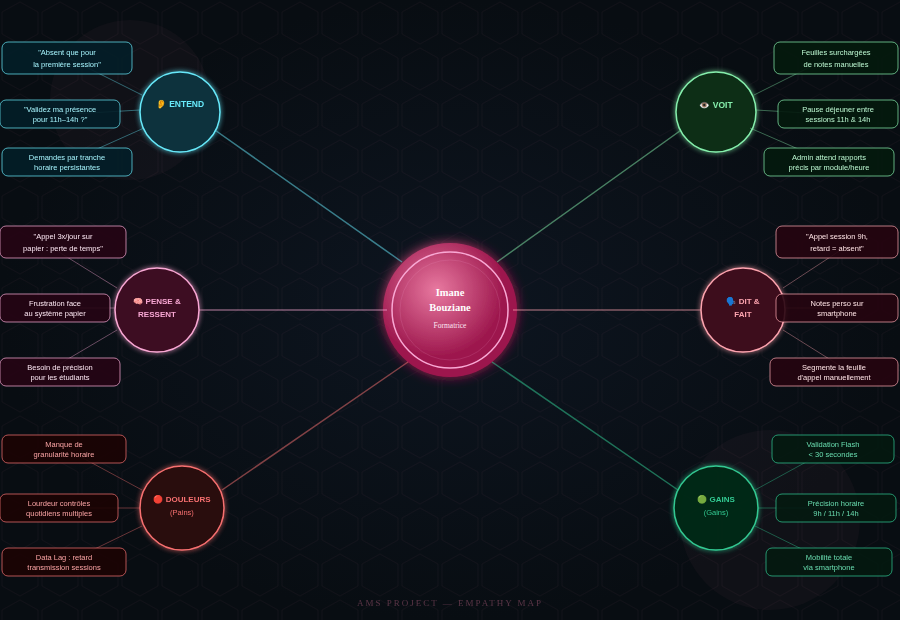
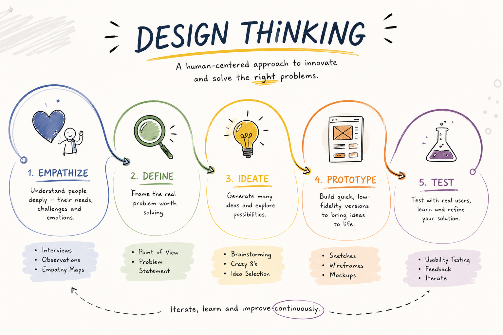
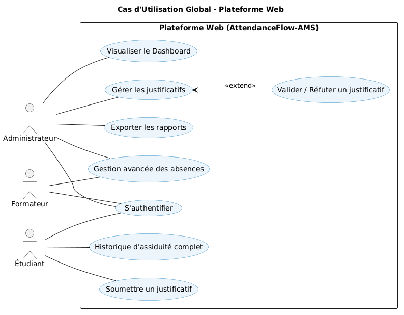
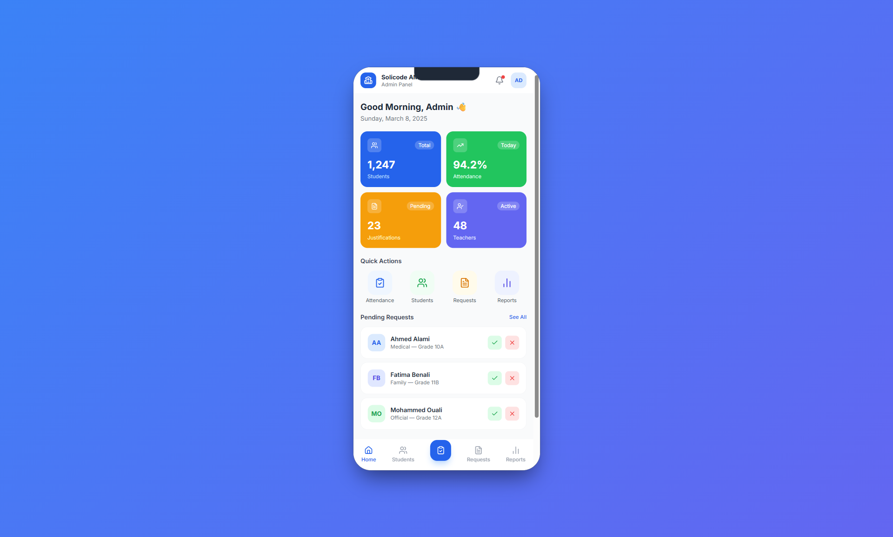
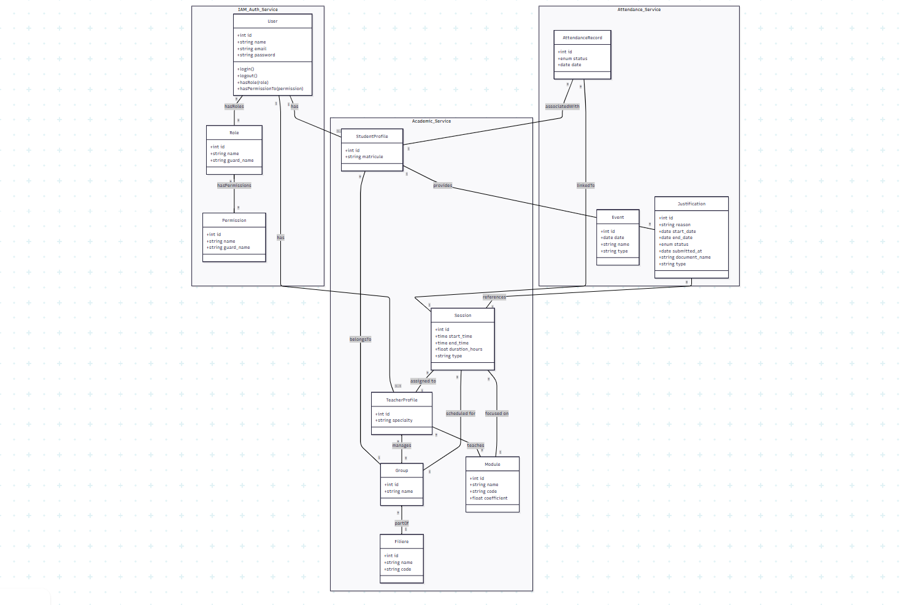

  
  

# **Projet de Fin de Formation**

### AttendanceFlow-AMS

**Système de Gestion des Absences**

**Réalisé par :** Abdelhay Mallouli  
**Encadré par :** M. ESSARRAJ Fouad  
**Filière :** Développement Mobile

---

## Sommaire

  

1

Contexte du projet

  

2

Méthodologie de travail

  

3

Branche Fonctionnelle

  

4

Branche Technique

  

5

Conception

    

6

Démonstration

  

7

Conclusion

---

## 1. Contexte du projet

  

---

## 1. Contexte : Carte d'Empathie - Mme Hannane

  

---

## 1. Contexte : Carte d'Empathie - Anouar

  

---

## 1. Contexte : Carte d'Empathie - Mme Imane

  

---

## 2. Méthodologie : Design Thinking

  
  
Empathie → Définition → Idéation → Prototype → Test

---

## 2. Méthodologie : Scrum (Agile)

  
  
Itérations rapides pour une livraison continue de valeur.

---

## 3. Branche Fonctionnelle : Définition du Problème

  
Le problème majeur réside dans la transition inefficace du <strong>support papier vers la saisie manuelle sur Excel</strong>.

  
Ce processus archaïque génère une surcharge logistique pour les formateurs et un décalage d'information critique pour l'administration.

  
<strong>Objectif :</strong> Suppression de la "double saisie" par une automatisation directe à la source.

---

## 3. Branche Fonctionnelle : Web (Global)

---

## 3. Branche Fonctionnelle : Mobile (Global)

---

## Branche Fonctionnelle : Maquettes (UI/UX)

  

    
    
Tableau de Bord Administratif (Web)

  

  

    
    
Application Mobile (Saisie Terrain)

  

---

## 4. Branche Technique : Tech Stack

  

    <h4>Backend & Architecture</h4>
    <ul>
      <li><strong>Laravel 12 (PHP 8.2+) :</strong> Coeur d'application robuste.</li>
      <li><strong>Architecture Service-Pattern :</strong> Découplage de la logique métier.</li>
      <li><strong>Base de données :</strong> MySQL relationnelle.</li>
    </ul>
  

  

    <h4>Frontend & Outillage</h4>
    <ul>
      <li><strong>Blade & Tailwind CSS :</strong> Interface responsive et premium.</li>
      <li><strong>Livewire / Alpine.js :</strong> Interactivité temps réel.</li>
      <li><strong>Vite :</strong> Compilation ultra-rapide des assets.</li>
    </ul>
  

---

## 5. Conception : Diagramme de Classe

  

    
    
Diagramme de Classe

  

---

## Merci pour votre attention !
