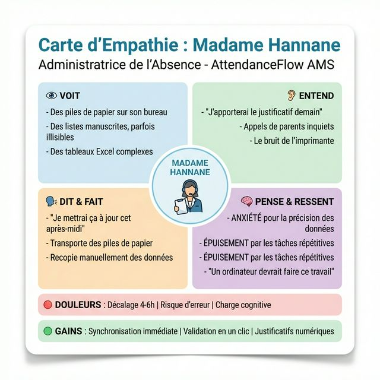

# 🔧 Branche Fonctionnelle

```{=openxml}
<w:p><w:r><w:br w:type="page"/></w:r></w:p>
```

## 1. Empathie

L'entretien mené le **15 novembre 2025** avec **Madame Hannane**, Administratrice de l'Absence au sein de l'établissement scolaire, a constitué le point de départ de notre démarche de Design Thinking. Cette rencontre nous a permis de cartographier précisément les défis quotidiens auxquels elle est confrontée. Il en ressort que près de **70% de son temps de travail** est consacré à des tâches de saisie manuelle : collecte des fiches papier auprès des enseignants le matin, puis retranscription dans un tableur Excel l'après-midi. Cette organisation génère un **décalage de 4 à 6 heures** entre le moment où une absence est constatée en classe et sa disponibilité dans le système, rendant toute réaction rapide impossible.

Au-delà du temps perdu, c'est la **charge cognitive** liée à la lecture de listes manuscrites, parfois illisibles, qui fragilise la fiabilité des données et expose l'administration à des erreurs d'enregistrement. Madame Hannane exprime clairement sa frustration : elle se sent comme un "pont humain" entre le papier et le numérique, réalisant un travail que l'outil informatique devrait prendre en charge automatiquement.

**Carte d'Empathie :**



| Segment | Observations |
| --- | --- |
| **DIT** | "Je mettrai le système à jour cet après-midi", "Est-ce un 'B' ou un '8' ?" |
| **PENSE** | "Je fais un travail qu'un ordinateur devrait faire", "J'espère n'avoir rien oublié." |
| **FAIT** | Recopie les fiches papier, répond aux appels stressés des parents. |
| **RESSENT** | Anxiété vis-à-vis de l'exactitude, épuisement par la répétition. |

```{=openxml}
<w:p><w:r><w:br w:type="page"/></w:r></w:p>
```

## 2. Définition du Problème

L'analyse approfondie de la phase d'empathie nous a permis de formuler avec précision le problème central auquel répond AttendanceFlow-AMS. L'administratrice de l'absence se retrouve piégée dans un flux de travail archaïque, caractérisé par une double saisie systématique : les enseignants remettent des informations sur support papier, que l'administration doit ensuite retranscrire manuellement dans un outil numérique. Ce processus, en plus d'être chronophage, est une source de risques élevés : perte de documents, erreurs de saisie, données obsolètes en temps réel, et une charge mentale continue qui nuit à la qualité du travail administratif.

> **Énoncé du problème :** L'Administratrice de l'Absence a besoin d'un système qui lui permette de recevoir, visualiser et valider les données de présence en temps réel, sans aucune retranscription manuelle, afin de garantir la fiabilité des informations et de se concentrer sur la vérification plutôt que sur la saisie.

Pour guider la phase d'idéation, nous avons formulé les questions suivantes selon la méthode **"How Might We"** :

1.  **Comment pourrions-nous** permettre aux enseignants d'enregistrer les présences directement, à la source, sans passer par un support papier ?
2.  **Comment pourrions-nous** offrir à l'administratrice une vue instantanée et lisible du statut de l'ensemble des étudiants ?
3.  **Comment pourrions-nous** dématérialiser entièrement le processus de soumission et de validation des justificatifs d'absence ?

```{=openxml}
<w:p><w:r><w:br w:type="page"/></w:r></w:p>
```

## 3. Idéation

Fort des enseignements tirés des phases d'empathie et de définition, notre équipe a engagé une session de brainstorming structurée visant à identifier les solutions les plus adaptées aux besoins exprimés. Trois axes stratégiques ont été retenus comme fondements de la solution :

La première solution (**Saisie Mobile et Web par l'Enseignant**) propose de déplacer le point d'entrée des données directement dans la salle de classe. En permettant à chaque enseignant de marquer les présences via une application responsive dès les premières minutes du cours, on supprime à la racine le recours au papier et le délai qui en découle. L'information est disponible instantanément dans le système.

La deuxième solution (**Hub de Vérification Administrateur**) transforme le rôle de l'administratrice. Au lieu de saisir des données, elle se concentre uniquement sur la **validation et la gestion des exceptions**. Un tableau de bord visuel, utilisant un système de codes couleurs (vert : présent, rouge : absent, jaune : justifié), lui permet de scanner l'état de toutes les classes en quelques secondes, sans lire chaque ligne.

La troisième solution (**Gestion Numérique des Justificatifs**) clôt le cycle en dématérialisant entièrement les certificats médicaux et billets d'absence. Les justificatifs sont téléchargés directement dans le système, liés à l'absence concernée, et soumis à une approbation ou un rejet en un seul clic, garantissant une traçabilité complète.

```{=openxml}
<w:p><w:r><w:br w:type="page"/></w:r></w:p>
```

## 4. Diagramme de Cas d'Utilisation

Le diagramme de cas d'utilisation ci-dessous modélise l'ensemble des interactions entre les acteurs du système — l'**Enseignant** et l'**Administrateur de l'Absence** — et les 12 cas d'utilisation identifiés pour AttendanceFlow-AMS. Afin de refléter la progression itérative du développement selon la méthodologie Scrum, les cas d'utilisation sont organisés par sprint et documentés dans des fichiers dédiés.

**Diagramme global :** `Analyse/cas_utilisation/use_case.puml`

| Sprint | Acteurs | Cas d'Utilisation |
| --- | --- | --- |
| **Sprint 1** | Enseignant, Admin | UC01 : S'authentifier, UC02 : Gérer son profil |
| **Sprint 2** | Enseignant, Admin | UC03 : Enregistrer présences, UC04 : Modifier saisie, UC05 : Consulter liste |
| **Sprint 3** | Administrateur | UC06–UC12 : Dashboard, Filtres, Justificatifs, Export, Historique |

**Diagrammes détaillés par sprint :**
- `Analyse/cas_utilisation/cas_utilisation_sprints/sprint1.puml`
- `Analyse/cas_utilisation/cas_utilisation_sprints/sprint2.puml`
- `Analyse/cas_utilisation/cas_utilisation_sprints/sprint3.puml`

```{=openxml}
<w:p><w:r><w:br w:type="page"/></w:r></w:p>
```

## 5. Division en Sprints

L'approche **Scrum (Agile)** adoptée pour ce projet structure le développement en cinq sprints itératifs. Chaque sprint délivre un ensemble cohérent de fonctionnalités testables, en priorisant les briques fondamentales avant d'enrichir progressivement le système. Cette organisation garantit une livraison continue de valeur et une capacité d'adaptation aux retours utilisateurs.

| Sprint | Durée | Objectif Principal | Fonctionnalités |
| --- | --- | --- | --- |
| **Sprint 1** | 1 semaine | Authentification & Rôles | Connexion sécurisée, gestion des rôles Enseignant / Administrateur |
| **Sprint 2** | 1 semaine | Saisie des Présences | Formulaire de marquage (Présent/Absent/Retard), modification d'une saisie |
| **Sprint 3** | 1 semaine | Dashboard Administrateur | Tableau de bord temps réel, filtres par classe et par date, code couleur |
| **Sprint 4** | 1 semaine | Gestion des Justificatifs | Upload de fichier, workflow d'approbation / rejet, notifications |
| **Sprint 5** | 1 semaine | Rapports & Export | Génération de rapports PDF / Excel, historique des absences |

```{=openxml}
<w:p><w:r><w:br w:type="page"/></w:r></w:p>
```
