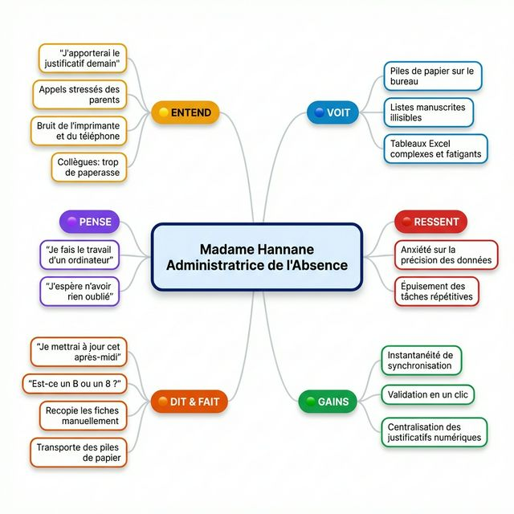
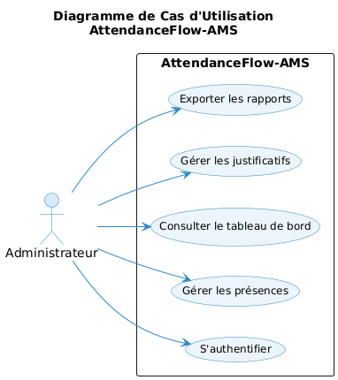
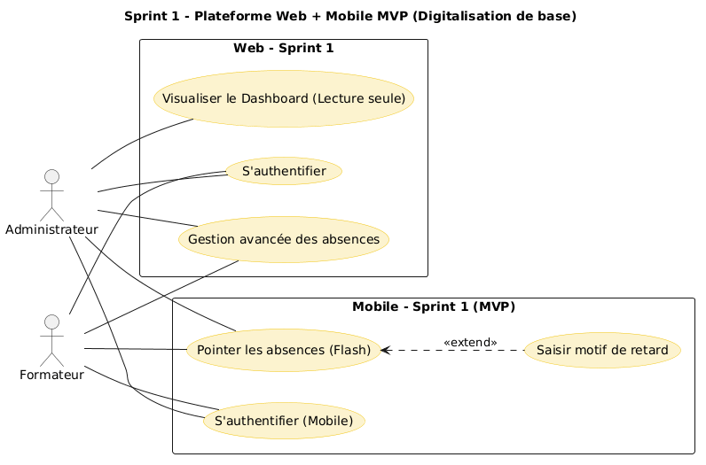
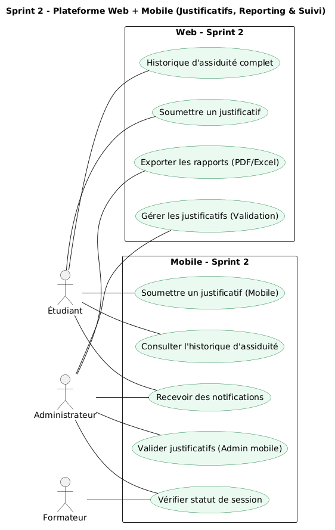
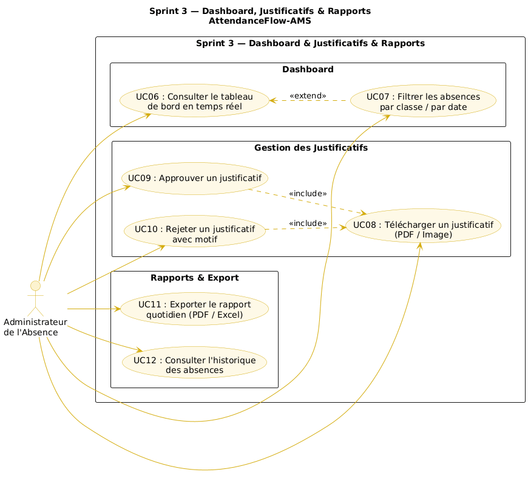

# Branche Fonctionnelle

La branche fonctionnelle constitue le cœur de notre analyse. Elle vise à traduire les besoins abstraits des utilisateurs en une structure de solution concrète. En nous appuyant sur la méthodologie **Design Thinking**, nous explorons ici le parcours utilisateur depuis la compréhension profonde du problème jusqu'à la modélisation des solutions techniques, garantissant ainsi une application centrée sur l'humain et l'efficacité opérationnelle.

L'analyse fonctionnelle de ce projet suit la méthodologie **Design Thinking**, structurée en phases immersives pour garantir que la solution répond aux besoins réels des utilisateurs.

### 1. Empathie
L'approche **Design Thinking** commence par l'immersion. Dans cette phase, nous avons cherché à comprendre profondément les défis quotidiens de **Madame Hannane**, Administratrice de l'Absence. Son flux de travail actuel est marqué par une surcharge de tâches manuelles et une dépendance critique au support papier.

L'entretien réalisé nous a permis de cartographier ses expériences à travers une **Carte d'Empathie**. Cet outil nous aide à visualiser ce qu'elle voit (des piles de papier), ce qu'elle entend (les plaintes sur la paperasse), ce qu'elle pense (le besoin d'automatisation) et ce qu'elle ressent (l'anxiété sur la fiabilité des données).



**Synthèse de l'Expérience Utilisateur :**
- **Observations :** Plus de 70% de son temps est gaspillé en saisie de données.
- **Points de Friction :** Des listes manuscrites illisibles et un décalage de plusieurs heures entre le relevé et la saisie.
- **Objectif :** Transformer son rôle de "saisisseur de données" en "validateur de données".

```{=openxml}
<w:p><w:r><w:br w:type="page"/></w:r></w:p>
```

### 2. Définition du Problème
Suite à la phase d'empathie, nous avons synthétisé nos découvertes pour isoler le problème central. L'analyse révèle que le système actuel de "double saisie" (papier puis Excel) est la source principale d'inefficacité et d'erreurs.

**Énoncé du problème :**
> Madame Hannane a besoin d'une méthode de réception des données **numériques et en temps réel** de la part des enseignants, car le système actuel cause un décalage de 4 à 6 heures et une fatigue cognitive élevée, mettant en péril la fiabilité des dossiers scolaires.

**Questions "How Might We" (HMW) :**
Pour stimuler notre créativité, nous avons posé trois questions directrices :
1. **Comment pourrions-nous** éliminer totalement le transfert physique des fiches papier de la salle de classe ?
2. **Comment pourrions-nous** permettre à l'administrateur de traiter le statut de plus de 120 étudiants en un coup d'œil ?
3. **Comment pourrions-nous** dématérialiser l'approbation des justificatifs médicaux ?

**Besoins Fonctionnels Identifiés :**
- **Accès par Rôles :** Permissions distinctes pour Enseignants, Administrateurs et Étudiants.
- **Synchronisation en Temps Réel :** Données instantanément visibles sur le tableau de bord Admin.
- **Indicateurs Visuels :** Utilisation de couleurs et icônes pour un balayage rapide.
- **Gestion Numérique :** Capacité de stocker des justificatifs (PDF/Images) liés aux records d'absence.

```{=openxml}
<w:p><w:r><w:br w:type="page"/></w:r></w:p>
```

### 3. Idéation
La phase d'idéation nous a permis d'explorer des solutions concrètes. Notre vision est celle d'un flux **"Direct-to-System"** où l'information ne subit aucune friction intermédiaire. L'objectif est de transformer le rôle de l'Administrateur, de la "Saisie de données" vers la "Vérification de données".

**Solutions Stratégiques Retenues :**
- **Saisie Directe (Mobile/Web) :** L'enseignant enregistre les présences numériquement durant les 10 premières minutes de cours.
- **Hub de Validation "One-Click" :** Un tableau de bord administratif utilisant un code couleur (Rouge: Absent, Vert: Présent, Jaune: Justifié) pour scanner rapidement l'état.
- **Cloud de Justificatifs :** Un portail où les étudiants/parents soumettent leurs preuves numériques, liées directement aux absences.

**Brainstorming des Fonctionnalités :**
- **Alertes Automatisées :** Notifications si un étudiant manque plusieurs cours consécutifs.
- **Validation Interactive :** L'Admin clique sur "Approuver" ou "Rejeter" pour les justificatifs téléchargés.
- **Export Intelligent :** Génération de rapports Excel/PDF en un clic pour les résumés quotidiens.

```{=openxml}
<w:p><w:r><w:br w:type="page"/></w:r></w:p>
```

### 4. Diagramme de Cas d'Utilisation
Le diagramme global définit l'étendue du système **AttendanceFlow-AMS**. Il illustre comment l'Administrateur interagit avec les fonctionnalités clés de gestion, de consultation et de rapportage, tout en maintenant un accès sécurisé.



### 5. Cas d'Utilisation --- Périmètre MVP (Minimum Viable Product)

Le développement de l'application est itératif. Notre MVP se concentre sur le flux critique : la sécurisation des accès et la suppression du décalage de saisie des absences.

#### Core Fonctionnalité 1 : Authentification & Sécurité (UC01)
Le socle du système repose sur une identification rigoureuse des acteurs pour garantir l'intégrité des données de présence.



*   **Acteurs :** Administrateur, Enseignant, Étudiant.
*   **Objectif :** Accès différencié aux fonctionnalités selon le rôle.

#### Core Fonctionnalité 2 : Saisie Mobile en Temps Réel (UC03)
C'est la solution directe aux problèmes de décalage identifiés. L'enseignant devient l'émetteur direct de l'information.



*   **Acteurs :** Enseignant.
*   **Objectif :** Marquage des absences dès les premières minutes de cours via une interface responsive.

---

### 6. Perspectives et Évolutions Post-MVP
Une fois le flux critique stabilisé, le système s'enrichira de fonctionnalités de gestion avancées pour optimiser totalement le rôle de l'administrateur.

#### Itération 2 : Gestion des Exceptions et Justificatifs (UC04, UC06)
Numérisation totale du cycle de vie des justificatifs pour supprimer définitivement la paperasse.


#### Itération 3 : Dashboard Analytique & Exports (UC05)
Transformation des données brutes en indicateurs de performance et génération automatique des rapports légaux.


