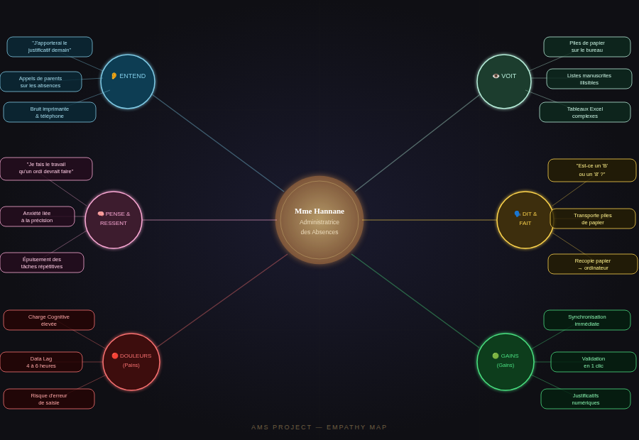
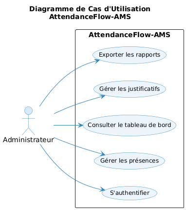
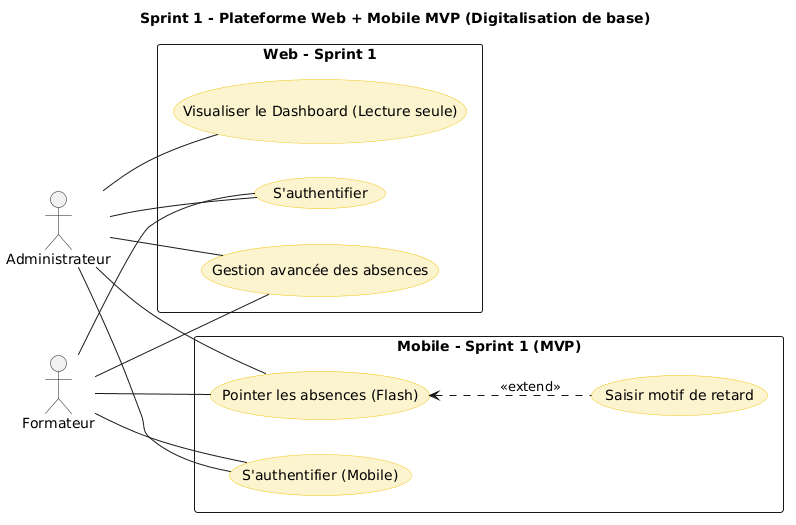
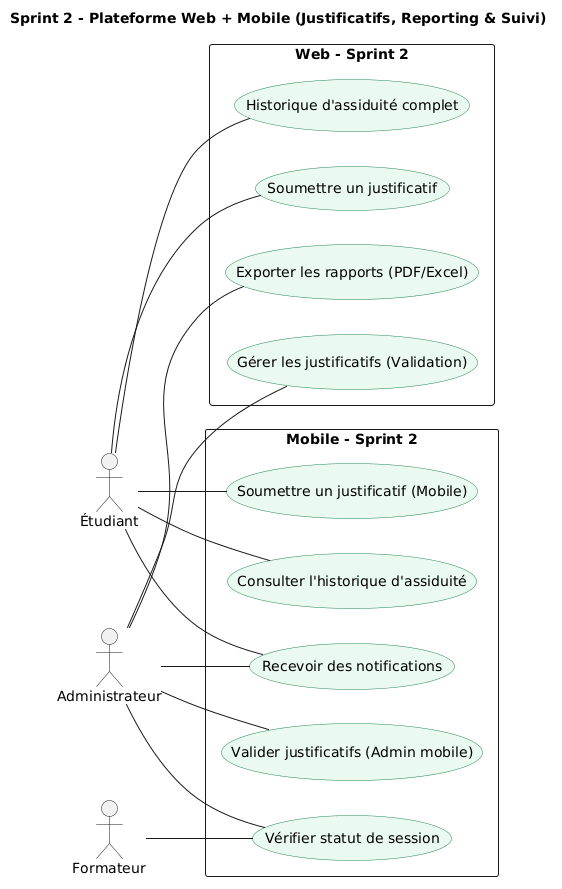
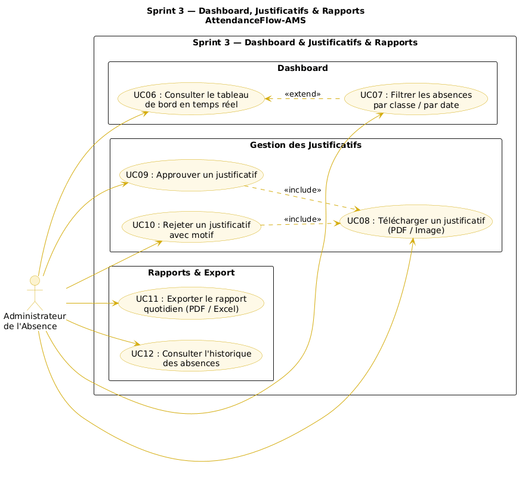

# Branche Fonctionnelle

La branche fonctionnelle constitue le cœur de notre analyse. Elle vise à traduire les besoins abstraits des utilisateurs en une structure de solution concrète. En nous appuyant sur la méthodologie **Design Thinking**, nous explorons ici le parcours utilisateur depuis la compréhension profonde du problème jusqu'à la modélisation des solutions techniques, garantissant ainsi une application centrée sur l'humain et l'efficacité opérationnelle.

L'analyse fonctionnelle de ce projet suit la méthodologie **Design Thinking**, structurée en phases immersives pour garantir que la solution répond aux besoins réels des utilisateurs.

### 1. Empathie
L'approche **Design Thinking** commence par l'immersion. Dans cette phase, nous avons cherché à comprendre profondément les défis quotidiens de nos trois acteurs clés : l'administratrice, l'enseignant et l'étudiant.

#### A. Madame Hannane (Administratrice de l'Absence)
Son flux de travail actuel est marqué par une surcharge de tâches manuelles et une dépendance critique au support papier. Le passage de la "saisie" à la "validation" est son besoin prioritaire.



**Analyse de l'Expérience :**
- **Points de Friction :** Des listes manuscrites illisibles, un décalage (data lag) de 4 à 6 heures, et une peur constante de l'erreur humaine.
- **Besoins Clés :** Transformation de son rôle en validateur de données, synchronisation immédiate et suppression du support papier.

#### B. Anouar Benyakhelef (Étudiant)
Pour l'étudiant, l'opacité du système actuel génère du stress et une lourdeur administrative inutile, notamment pour la gestion des justificatifs.


**Analyse de l'Expérience :**
- **Points de Friction :** Manque de visibilité sur son assiduité, besoin de se déplacer physiquement à l'administration pour chaque démarche.
- **Besoins Clés :** Transparence en temps réel sur son compteur d'absences et autonomie dans la soumission numérique des justificatifs.

#### C. Imane Bouziane (Formatrice)
La formatrice voit la gestion des absences comme un "vol" de temps pédagogique, surtout avec la nécessité de pointer les étudiants par session (9h-11h, 11h-14h, 14h-17h).


**Analyse de l'Expérience :**
- **Points de Friction :** Difficulté à segmenter les présences par tranches horaires sur papier, logistique lourde des fiches et interruption du rythme des cours.
- **Besoins Clés :** Validation granulaire par session (9-11, 11-14, 14-17), interface mobile fluide et synchronisation automatique avec l'administration.

**Synthèse Globale de l'Empathie :**
L'analyse croisée de ces trois profils révèle un besoin commun : la **suppression du support physique** au profit d'un flux numérique fluide, sécurisé et instantané.

```{=openxml}
<w:p><w:r><w:br w:type="page"/></w:r></w:p>
```

### 2. Définition du Problème
Suite à la phase d'empathie, nous avons synthétisé nos découvertes pour isoler le problème central. L'analyse révèle que le système actuel de "double saisie" (papier puis Excel) est la source principale d'inefficacité et d'erreurs.

**Énoncé du problème global :**
> Le problème central est l'inefficacité du flux de travail actuel qui repose sur le passage du **support papier vers une saisie manuelle sur Excel**. Cette méthode génère une surcharge logistique pour les formateurs (notamment pour la segmentation complexe des sessions 9-11, 11-14, 14-17) et un décalage d'information critique pour l'administration, compromettant la fiabilité globale du système.

**Questions "How Might We" (HMW) :**
Pour stimuler notre créativité, nous avons posé trois questions directrices :
1. **Comment pourrions-nous** éliminer totalement le transfert physique des fiches papier de la salle de classe ?
2. **Comment pourrions-nous** permettre à l'enseignant de valider chaque session (9-11, 11-14, 14-17) en moins de 30 secondes ?
3. **Comment pourrions-nous** dématérialiser l'approbation des justificatifs médicaux ?

**Besoins Fonctionnels Identifiés :**
- **Accès par Rôles :** Permissions distinctes pour Enseignants, Administrateurs et Étudiants.
- **Synchronisation en Temps Réel :** Données instantanément visibles sur le tableau de bord Admin.
- **Indicateurs Visuels :** Utilisation de couleurs et icônes pour un balayage rapide.
- **Gestion Numérique :** Capacité de stocker des justificatifs (PDF/Images) liés aux records d'absence.

```{=openxml}
<w:p><w:r><w:br w:type="page"/></w:r></w:p>
```

### 3. Idéation
La phase d'idéation nous a permis d'explorer des solutions concrètes. Notre vision est celle d'un flux **"Direct-to-System"** où l'information ne subit aucune friction intermédiaire. L'objectif est de transformer le rôle de l'Administrateur, de la "Saisie de données" vers la "Vérification de données".

**Solutions Stratégiques Retenues :**
- **Saisie Directe par Session (Mobile/Web) :** L'enseignant enregistre les présences numériquement pour chaque tranche horaire (9h-11h, 11h-14h, 14h-17h).
- **Hub de Validation "One-Click" :** Un tableau de bord administratif utilisant un code couleur (Rouge: Absent, Vert: Présent, Jaune: Justifié) pour scanner rapidement l'état.
- **Cloud de Justificatifs :** Un portail où les étudiants/parents soumettent leurs preuves numériques, liées directement aux absences.

**Brainstorming des Fonctionnalités :**
- **Alertes Automatisées :** Notifications si un étudiant manque plusieurs cours consécutifs.
- **Validation Interactive :** L'Admin clique sur "Approuver" ou "Rejeter" pour les justificatifs téléchargés.
- **Export Intelligent :** Génération de rapports Excel/PDF en un clic pour les résumés quotidiens.

```{=openxml}
<w:p><w:r><w:br w:type="page"/></w:r></w:p>
```

### 4. Diagramme de Cas d'Utilisation Global
Le diagramme global définit l'étendue complète du système **AttendanceFlow-AMS**. Il illustre les interactions des trois acteurs clés (Administrateur, Formateur, Étudiant) avec les piliers du projet : le pointage granulaire par session, la validation administrative et la transparence pour l'étudiant.



### 5. Cas d'Utilisation --- Périmètre MVP (Minimum Viable Product)

#### Itération 1 — MVP : Digitalisation du Pointage (Sprint 1)
Le socle du système repose sur la résolution du problème critique "Papier vers Excel". L'objectif est de permettre un pointage direct à la source.



*   **Acteurs :** Administrateur, Formateur.
*   **Objectif :** Authentification sécurisée et marquage des absences par session (9-11, 11-14, 14-17) avec synchronisation temps réel.

#### Itération 2 : Justificatifs & Consultation (Sprint 2)
Cette itération apporte la boucle de rétroaction nécessaire pour l'étudiant et simplifie la gestion des dossiers médicaux.



*   **Acteurs :** Administrateur, Étudiant.
*   **Objectif :** Soumission numérique des justificatifs et consultation individuelle des statistiques d'assiduité.

### 6. Perspectives et Évolutions Post-MVP
Une fois le flux critique stabilisé, le système s'enrichira de fonctionnalités de gestion avancées pour optimiser totalement le rôle de l'administrateur.

#### Itération 2 : Gestion des Exceptions et Justificatifs (Sprint 2 continu)
Numérisation totale du cycle de vie des justificatifs pour supprimer définitivement la paperasse.


#### Itération 3 : Dashboard Analytique & Exports (UC05)
Transformation des données brutes en indicateurs de performance et génération automatique des rapports légaux.


