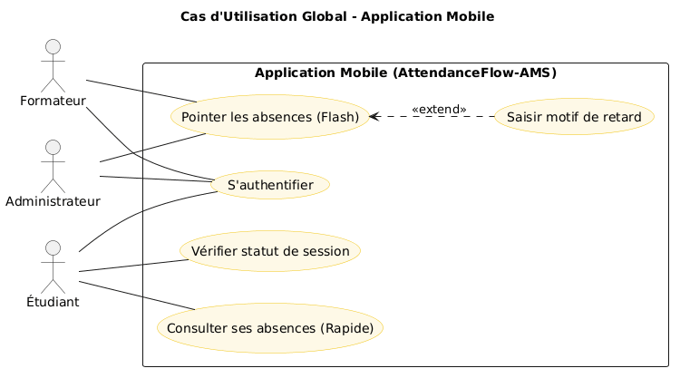
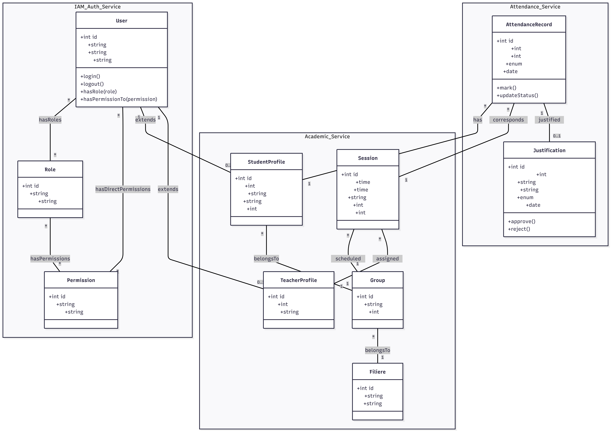

<div align="center">

<br>

| | |
|:---:|:---:|
| {width=140px} | {width=140px} |

<br><br><br>

**REPORT FINAL DE PROJET**


<br>

***

<br>

**AttendanceFlow-AMS**
*Système de Gestion des Absences*

<br>

***

<br><br><br>

| | |
|:--- | ---:|
| **Submitted by:** | **Academic Year:** |
| **Mallouli Abdelhay** | **2025 - 2026** |
| | |
| **Supervisor:** | **Filière:** |
| **Mr. Essarraj Fouad** | **Développement Mobile** |

<br><br><br><br><br>

**SOLICODE – Digital & IT Training Center**
*www.solicode.co*

</div>

```{=openxml}
<w:p><w:r><w:br w:type="page"/></w:r></w:p>
```
# 📋 Table of Contents

```{=openxml}
<w:p><w:r><w:fldChar w:fldCharType="begin"/></w:r><w:r><w:instrText xml:space="preserve"> TOC \o "1-3" \h \z \u </w:instrText></w:r><w:r><w:fldChar w:fldCharType="separate"/></w:r><w:r><w:fldChar w:fldCharType="end"/></w:r></w:p>
```

```{=openxml}
<w:p><w:r><w:br w:type="page"/></w:r></w:p>
```
# 📜 Remerciements

Au terme de ce projet, je tiens à exprimer ma profonde gratitude et mes sincères remerciements à toutes les personnes qui ont contribué de près ou de loin à la réalisation de ce travail.

Mes remerciements s'adressent tout particulièrement à mon encadrant, **Monsieur ESSARRAJ Fouad**, pour sa disponibilité, sa patience et ses conseils précieux. Sa vision technique et son accompagnement constant ont été des piliers essentiels pour mener à bien ce projet de gestion d'assiduité.

Je tiens également à remercier l'ensemble de l'équipe pédagogique du centre **SoliCode** pour la qualité de la formation et l'environnement d'apprentissage stimulant qu'ils nous offrent au quotidien.

Enfin, je remercie ma famille et mes amis pour leur soutien indéfectible et leurs encouragements tout au long de mon parcours de formation.

```{=openxml}
<w:p><w:r><w:br w:type="page"/></w:r></w:p>
```

# 🚀 Introduction

Le projet **AttendanceFlow-AMS** est une réponse technologique moderne aux défis logistiques de la gestion de l'assiduité en centre de formation. En alliant ergonomie mobile et puissance administrative web, il redéfinit le suivi des présences comme un flux continu et transparent.

```{=openxml}
<w:p><w:r><w:br w:type="page"/></w:r></w:p>
```

# 🏙️ Contexte de projet

## Objectifs de formation (SoliCode)

Le projet **AttendanceFlow-AMS** s'inscrit dans le cadre de la formation "Développement Mobile et Web" au sein de **SoliCode**. Les objectifs pédagogiques principaux sont :

*   **Maîtrise de l'Agilité :** Application concrète des frameworks Scrum et Design Thinking sur un projet réel.
*   **Expertise Full-Stack :** Utilisation de technologies modernes (Laravel, Tailwind CSS, Alpine.js) pour créer une solution complète.
*   **Conception Centrée Utilisateur :** Passage du besoin abstrait à une interface fonctionnelle et ergonomique.
*   **Professionnalisation :** Simulation d'un environnement de production avec gestion de version (Git) et documentation technique.

```{=openxml}
<w:p><w:r><w:br w:type="page"/></w:r></w:p>
```


# 📑 Cahier des Charges

**Rôle :** Architecture Système & Analyse
**Projet :** Système de Gestion des Absences (AMS) pour SoliCode

---

## 1. Introduction & Vision
AttendanceFlow-AMS est une solution numérique intégrée visant à supprimer le goulot d'étranglement de la gestion manuelle des absences. La vision centrale est d'automatiser le flux de données de la salle de classe (Terrain) vers l'administration (Core) en temps réel.

## 2. Objectifs du Système
- **Suppression du Papier :** Digitalisation 100% du pointage.
- **Précision Granulaire :** Gestion des absences par sessions (9-11, 11-14, 14-17).
- **Réactivité Administrative :** Disponibilité immédiate des données pour validation.
- **Transparence Étudiante :** Consultation autonome par les apprenants.

## 3. Spécifications Fonctionnelles

### 3.1 Profil Formateur (Mobile-First)
- Authentification sécurisée.
- Pointage "Flash" : sélection rapide des absents/présents par session.
- Saisie des motifs de retard en temps réel.
- Historique des sessions récentes.

### 3.2 Profil Administrateur (Back-Office Web)
- Dashboard global de monitoring.
- Hub de validation des pointages formateurs.
- Gestion des justificatifs (Visualisation et Approbation).
- Exportation de rapports dynamiques (PDF/Excel).

### 3.3 Profil Étudiant (Consultation)
- Tableau de bord personnel d'assiduité.
- Soumission numérique de justificatifs.
- Notifications d'alertes en cas de dépassement de quota.

## 4. Spécifications Techniques (Architecture)
- **Backend :** Laravel 12 (Robustesse & Sécurité).
- **Frontend :** Tailwind CSS & Alpine.js (UX Premium & Performance).
- **Database :** MySQL (Intégrité référentielle des records d'absence).
- **Architecture :** Service-Pattern pour le découplage métier.

## 5. Contraintes & Performance
- **Temps de saisie :** Inférieur à 30 secondes pour une classe complète.
- **Synchronisation :** Immédiate (Real-time update).
- **Responsive :** Adaptabilité totale Web & Mobile.

---

```{=openxml}
<w:p><w:r><w:br w:type="page"/></w:r></w:p>
```
# 🛠️ Méthodes de travail

L'approche adoptée pour ce projet repose sur une symbiose entre deux cadres de référence majeurs : l'agilité de **Scrum** et la philosophie du **Design Thinking**. Cette combinaison garantit une solution rigoureusement centrée sur l'utilisateur et une livraison itérative de valeur.

---

## 📅 Méthodologie Scrum

Scrum est le cadre de travail agile utilisé pour livrer de la valeur de manière itérative. Nous avons structuré le développement d'**AttendanceFlow-AMS** en Sprints de deux semaines.


### 👥 Rôles & Évènements
*   **Rôles :** Product Owner (Vision), Scrum Master (Facilitateur), Équipe Dev (Réalisation).
*   **Cycles :** Sprint Planning, Daily Stand-up, Sprint Review et Sprint Retrospective pour une amélioration continue.

---

```{=openxml}
<w:p><w:r><w:br w:type="page"/></w:r></w:p>
```

## 🎨 Design Thinking : L'Humain au Centre

Le Design Thinking nous a permis de déconstruire le problème complexe du pointage papier pour aboutir à une interface intuitive.


### 💡 Phase 1 : Empathie (Compréhension des Acteurs)

Nous avons cartographié les frustrations et besoins de nos trois profils types via des **Mind Maps** détaillées. C'est cette analyse "terrain" qui a dicté la conception de l'application.

#### 👤 Madame Hannane (Administratrice)
Son besoin central est de passer du rôle de "saisisseuse" de données à celui de "validatrice".


#### 👤 Anouar Benyakhelef (Étudiant)
Son défi est l'opacité du système actuel ; il a besoin de transparence et d'autonomie.


#### 👤 Imane Bouziane (Formatrice)
Elle recherche la rapidité pour ne pas empiéter sur le temps pédagogique.


# Branche Fonctionnelle

La branche fonctionnelle constitue le cœur de notre analyse. Elle vise à traduire les besoins abstraits des utilisateurs en une structure de solution concrète. En nous appuyant sur la méthodologie **Design Thinking**, nous explorons ici le parcours utilisateur depuis la compréhension profonde du problème jusqu'à la modélisation des solutions techniques, garantissant ainsi une application centrée sur l'humain et l'efficacité opérationnelle.

L'analyse fonctionnelle de ce projet suit la méthodologie **Design Thinking**, structurée en phases immersives pour garantir que la solution répond aux besoins réels des utilisateurs.

### 1. Empathie

L'approche **Design Thinking** commence par l'immersion. Dans cette phase, nous avons cherché à comprendre profondément les défis quotidiens de nos trois acteurs clés : l'administratrice, l'enseignant et l'étudiant.

#### A. Madame Hannane (Administratrice de l'Absence)

Son flux de travail actuel est marqué par une surcharge de tâches manuelles et une dépendance critique au support papier. Le passage de la "saisie" à la "validation" est son besoin prioritaire.


**Analyse de l'Expérience :**

- **Points de Friction :** Des listes manuscrites illisibles, un décalage (data lag) de 4 à 6 heures, et une peur constante de l'erreur humaine.
- **Besoins Clés :** Transformation de son rôle en validateur de données, synchronisation immédiate et suppression du support papier.

#### B. Anouar Benyakhelef (Étudiant)

Pour l'étudiant, l'opacité du système actuel génère du stress et une lourdeur administrative inutile, notamment pour la gestion des justificatifs.


**Analyse de l'Expérience :**

- **Points de Friction :** Manque de visibilité sur son assiduité, besoin de se déplacer physiquement à l'administration pour chaque démarche.
- **Besoins Clés :** Transparence en temps réel sur son compteur d'absences et autonomie dans la soumission numérique des justificatifs.

#### C. Imane Bouziane (Formatrice)

La formatrice voit la gestion des absences comme un "vol" de temps pédagogique, surtout avec la nécessité de pointer les étudiants par session (9h-11h, 11h-14h, 14h-17h).


**Analyse de l'Expérience :**

- **Points de Friction :** Difficulté à segmenter les présences par tranches horaires sur papier, logistique lourde des fiches et interruption du rythme des cours.
- **Besoins Clés :** Validation granulaire par session (9-11, 11-14, 14-17), interface mobile fluide et synchronisation automatique avec l'administration.

**Synthèse Globale de l'Empathie :**
L'analyse croisée de ces trois profils révèle un besoin commun : la **suppression du support physique** au profit d'un flux numérique fluide, sécurisé et instantané.

```{=openxml}
<w:p><w:r><w:br w:type="page"/></w:r></w:p>
```

### 2. Définition du Problème

Suite à la phase d'empathie, nous avons synthétisé nos découvertes pour isoler le problème central. L'analyse révèle que le système actuel de "double saisie" (papier puis Excel) est la source principale d'inefficacité et d'erreurs.

**Énoncé du problème global :**

> Le problème central est l'inefficacité du flux de travail actuel qui repose sur le passage du **support papier vers une saisie manuelle sur Excel**. Cette méthode génère une surcharge logistique pour les formateurs (notamment pour la segmentation complexe des sessions 9-11, 11-14, 14-17) et un décalage d'information critique pour l'administration, compromettant la fiabilité globale du système.

**Questions "How Might We" (HMW) :**
Pour stimuler notre créativité, nous avons posé trois questions directrices :

1. **Comment pourrions-nous** éliminer totalement le transfert physique des fiches papier de la salle de classe ?
2. **Comment pourrions-nous** permettre à l'enseignant de valider chaque session (9-11, 11-14, 14-17) en moins de 30 secondes ?
3. **Comment pourrions-nous** dématérialiser l'approbation des justificatifs médicaux ?

**Besoins Fonctionnels Identifiés :**

- **Accès par Rôles :** Permissions distinctes pour Enseignants, Administrateurs et Étudiants.
- **Synchronisation en Temps Réel :** Données instantanément visibles sur le tableau de bord Admin.
- **Indicateurs Visuels :** Utilisation de couleurs et icônes pour un balayage rapide.
- **Gestion Numérique :** Capacité de stocker des justificatifs (PDF/Images) liés aux records d'absence.

```{=openxml}
<w:p><w:r><w:br w:type="page"/></w:r></w:p>
```

### 3. Idéation

La phase d'idéation nous a permis d'explorer des solutions concrètes. Notre vision est celle d'un flux **"Direct-to-System"** où l'information ne subit aucune friction intermédiaire. L'objectif est de transformer le rôle de l'Administrateur, de la "Saisie de données" vers la "Vérification de données".

**Solutions Stratégiques Retenues :**

- **Saisie Directe par Session (Mobile/Web) :** L'enseignant enregistre les présences numériquement pour chaque tranche horaire (9h-11h, 11h-14h, 14h-17h).
- **Hub de Validation "One-Click" :** Un tableau de bord administratif utilisant un code couleur (Rouge: Absent, Vert: Présent, Jaune: Justifié) pour scanner rapidement l'état.
- **Cloud de Justificatifs :** Un portail où les étudiants/parents soumettent leurs preuves numériques, liées directement aux absences.

**Brainstorming des Fonctionnalités :**

- **Alertes Automatisées :** Notifications si un étudiant manque plusieurs cours consécutifs.
- **Validation Interactive :** L'Admin clique sur "Approuver" ou "Rejeter" pour les justificatifs téléchargés.
- **Export Intelligent :** Génération de rapports Excel/PDF en un clic pour les résumés quotidiens.

```{=openxml}
<w:p><w:r><w:br w:type="page"/></w:r></w:p>
```

### 4. Diagrammes de Cas d'Utilisation Globaux

L'analyse fonctionnelle est divisée en deux écosystèmes complémentaires : la plateforme Web pour la gestion lourde et l'application Mobile pour les opérations de terrain.

#### A. Plateforme Web (Global)

La plateforme Web centralise la gestion des justificatifs, le reporting et le dashboard administratif.


#### B. Application Mobile (Global)

L'application mobile se concentre sur la rapidité de saisie et la mobilité.



---

### 5. Cas d'Utilisation par Sprints

Le développement est segmenté en sprints pour garantir une livraison itérative de valeur. Chaque sprint intègre à la fois les fonctionnalités Web (administration) et Mobile (terrain).

#### Sprint 1 : Digitalisation du Pointage (MVP Web & Mobile)

Ce sprint se concentre sur le remplacement du papier par le numérique pour les opérations critiques de pointage.


**Fonctionnalités clés :**
- **Web :** Authentification, visualisation du dashboard de base et gestion des absences.
- **Mobile :** Pointage "Flash" par session, saisie des motifs de retard et authentification.

#### Sprint 2 : Justificatifs & Intelligence Métier

Ce sprint apporte l'interactivité pour l'étudiant et la validation administrative avancée.


**Fonctionnalités clés :**
- **Web :** Soumission et validation des justificatifs, historique d'assiduité complet et export de rapports.
- **Mobile :** Consultation de l'historique d'assiduité et vérification du statut de session.

# 🏗️ Branche Technique

## Choix Technologiques

Le projet repose sur un écosystème robuste et moderne permettant une scalabilité verticale et horizontale.

*   **Backend :** Laravel 12, offrant un routage puissant, une sécurité intégrée et un ORM (Eloquent) performant.
*   **Frontend :** Blade Templates pour le rendu côté serveur, combiné à Tailwind CSS pour un design atomique et Alpine.js pour la réactivité.
*   **Base de données :** MySQL gérant les relations complexes entre les sessions, les étudiants et les pointages.
*   **Outils Externes :** Git/GitHub (Versionnement), Lucide Icons (Visuels), Preline UI (Composants).

```{=openxml}
<w:p><w:r><w:br w:type="page"/></w:r></w:p>
```

## Architecture du Système

### Architecture MVC
Nous utilisons le motif **Modèle-Vue-Contrôleur** nativement supporté par Laravel :
- **Modèle :** Gestion de la logique de données et des règles métier.
- **Vue :** Présentation des données aux utilisateurs via Blade.
- **Contrôleur :** Intermédiaire traitant les requêtes et orchestrant les réponses.

### Architecture en 3 Couches (3-Tier)
L'application est structurée pour séparer les responsabilités :
1.  **Couche Présentation (Client) :** Navigateurs Web et Application Mobile.
2.  **Couche Application (Serveur) :** Serveur Laravel traitant la logique métier.
3.  **Couche Données (Stockage) :** Serveur de base de données MySQL.

```{=openxml}
<w:p><w:r><w:br w:type="page"/></w:r></w:p>
```

## Prototype (Fonctionnalités & Classes)

Le prototype d'**AttendanceFlow-AMS** couvre les flux critiques :
-   **Section Administrateur :** Dashboard, gestion des étudiants, validation des justificatifs.
-   **Section Formateur :** Pointage par session (Flash), gestion des retards.
-   **Section Étudiant :** Consultation de l'assiduité, soumission de documents.

### Diagramme de Classe — Entités Principales
Les entités `User`, `Student`, `Teacher`, `Session`, `Attendance` et `Justification` forment le squelette du système, garantissant une intégrité référentielle stricte.

```{=openxml}
<w:p><w:r><w:br w:type="page"/></w:r></w:p>
```

# 🎨 Conception & UI Design

## Diagramme de Classe

Le diagramme de classe définit la structure de la base de données et les relations entre les entités clés (Utilisateurs, Sessions, Absences, Justificatifs).



```{=openxml}
<w:p><w:r><w:br w:type="page"/></w:r></w:p>
```

## Schéma des interfaces (Maquette UI/UX)

La conception visuelle repose sur une approche premium et responsive, utilisant Tailwind CSS pour garantir une expérience fluide sur tous les terminaux.

### Vue d'ensemble - Tableau de Bord Administratif (Web)


### Vue d'ensemble - Application Mobile


```{=openxml}
<w:p><w:r><w:br w:type="page"/></w:r></w:p>
```

# 💻 Réalisation

## Technologies utilisées (Tech Stack)

Le projet utilise des technologies de pointe pour offrir une interface premium et une architecture solide :

*   **Frontend :** Blade Templates, Tailwind CSS pour le style, et Alpine.js pour l'interactivité dynamique.
*   **Backend :** Laravel 12 (PHP 8.2+) gérant la logique métier, l'authentification et les accès.
*   **Base de Données :** MySQL pour le stockage relationnel des données d'assiduité.
*   **Composants UI :** Preline UI et Lucide Icons pour des interfaces professionnelles et claires.

```{=openxml}
<w:p><w:r><w:br w:type="page"/></w:r></w:p>
```

## Outils de développement & Gestion

*   **IDE :** Visual Studio Code avec l'assistant IA **Antigravity** pour l'accélération du développement.
*   **Gestion de Version :** Git et GitHub pour le suivi du code source.
*   **Gestion de Projet :** Méthodologie **Scrum** avec utilisation d'artéfacts Agiles (Sprints, Backlog).
*   **Conception :** PlantUML pour les diagrammes de cas d'utilisation et de classe.

```{=openxml}
<w:p><w:r><w:br w:type="page"/></w:r></w:p>
```

# ⭐ Conclusion

Le projet **AttendanceFlow-AMS** a permis de répondre efficacement aux défis de la gestion des absences au sein de **SoliCode**. En remplaçant les processus manuels par une solution numérique intégrée (Web & Mobile), nous avons atteint les objectifs de :

1.  **Fiabilité :** Suppression des erreurs de saisie et centralisation de l'information.
2.  **Productivité :** Gain de temps significatif pour les formateurs et l'administration.
3.  **Transparence :** Accès direct pour les étudiants à leurs données d'assiduité.

Cette expérience a été l'occasion de mettre en œuvre des méthodologies agiles (Scrum, Design Thinking) et des technologies de pointe (Laravel, Tailwind CSS). Les perspectives d'évolution incluent l'intégration de notifications automatisées et l'analyse prédictive pour lutter contre le décrochage scolaire.
