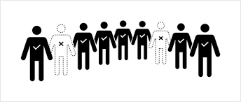
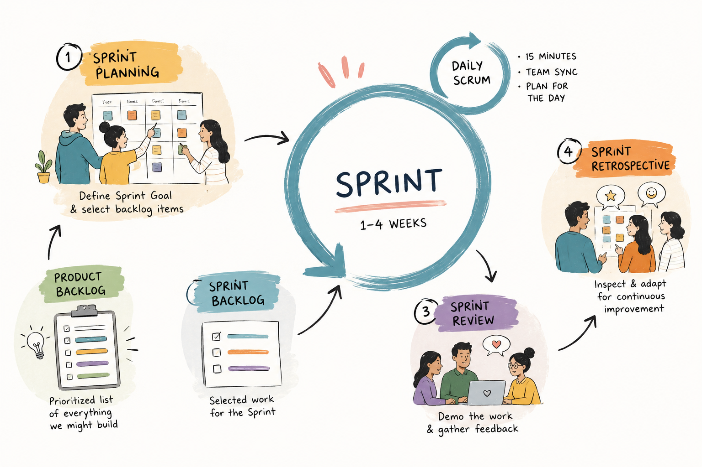
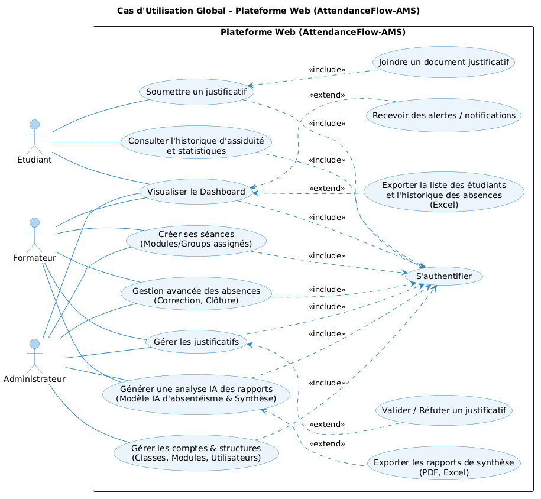
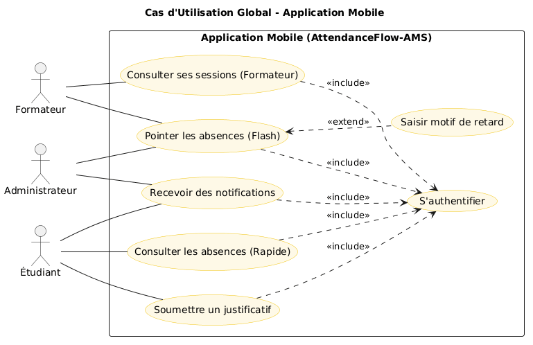
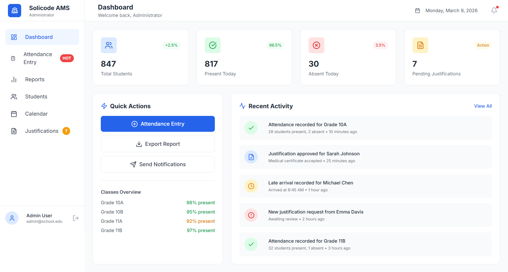
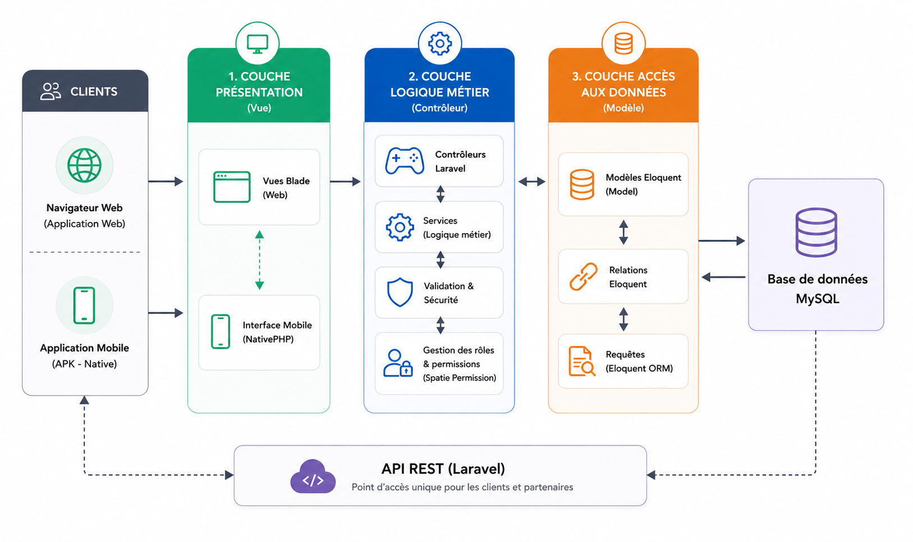

  
  

# **Projet de Fin de Formation**

### AttendanceFlow-AMS

**Système de Gestion des Absences de Nouvelle Génération**

**Réalisé par :** Abdelhay Mallouli  
**Encadré par :** M. ESSARRAJ Fouad  
**Filière :** Développement Mobile
**Date de Soutenance :** 12/06/2026

---

## Sommaire

  

1

Contexte du projet

  

2

Méthodologie & Agile

  

3

Branche Fonctionnelle

  

4

Conception (UML)

  

5

Réalisation :  (3-Tiers) - MVC - Utlies

  

6

Conclusion

---

## 1. Contexte du projet

  

---

## 2. Méthodologie : Design Thinking

  
  

    
Empathie → Définition → Idéation → Prototype → Test

  

---

## 2. Méthodologie : Scrum (Agile)

  
  

    
L'agilité au cœur du développement pour une fiabilité maximale.

  

---

## 3. Branche Fonctionnelle : Problématique

  

    "La transition inefficace du <strong>support papier</strong> vers la saisie manuelle sur <strong>Excel</strong> génère des erreurs et une perte de temps critique."
  

  
<strong>Impact :</strong> Surcharge logistique pour les formateurs et opacité pour l'administration.

  
<strong>Solution :</strong> Automatisation complète dès la source (Mobile) vers le Cloud (Web & Reports).

---

## 3. Branche Fonctionnelle : Écosystème Web

  

---

## 3. Branche Fonctionnelle : Excellence Mobile

  

---

## 3 Branche Fonctionnelle : Maquettes Premium

  

    

       
    

    
Dashboard Administratif (Web)

  

  

    

       
    

    
Application Mobile (Saisie Directe)

  

---

---

## 4. Conception : Diagramme de Classe

  
  

  

    Cliquez sur l’icône pour consulter le diagramme de classe.
  

---

## 5. Réalisation : Architecture 3-Tiers & MVC

  

---

## 5. Réalisation : Outils Utilisés

<table style="width:100%; border-collapse: collapse; font-size: 0.95em;">

  <tr style="background:#0984e3; color:white;">
    <th style="padding:12px;">Outil</th>
    <th style="padding:12px;">Rôle</th>
  </tr>

  <tr>
    <td style="padding:10px;">💻 Visual Studio Code</td>
    <td style="padding:10px;">Développement et édition du code source</td>
  </tr>

  <tr style="background:#f1f2f6;">
    <td style="padding:10px;">🔧 Git & GitHub</td>
    <td style="padding:10px;">Gestion de versions et collaboration</td>
  </tr>

  <tr>
    <td style="padding:10px;">📦 Composer</td>
    <td style="padding:10px;">Gestionnaire de dépendances PHP</td>
  </tr>

  <tr style="background:#f1f2f6;">
    <td style="padding:10px;">⚡ NPM & Vite</td>
    <td style="padding:10px;">Build frontend et optimisation des assets</td>
  </tr>

  <tr>
    <td style="padding:10px;">📐 PlantUML</td>
    <td style="padding:10px;">Conception UML et diagrammes techniques</td>
  </tr>

  <tr style="background:#f1f2f6;">
    <td style="padding:10px;">🗄️ MySQL</td>
    <td style="padding:10px;">Base de données relationnelle</td>
  </tr>

</table>

📱 Android SDK — Environnement de développement mobile Android

---
## 6. Conclusion

  

    Le projet <strong>AttendanceFlow-AMS</strong> a permis de digitaliser et d’optimiser la gestion des absences :
  

  <ul style="font-size: 1.1em; line-height: 2; padding-left: 20px; color: #636e72;">
    <li>✔ Amélioration de la fiabilité des données</li>
    <li>✔ Optimisation du suivi des étudiants</li>
    <li>✔ Réduction du temps de traitement</li>
    <li>✔ Expérience utilisateur modernisée</li>
  </ul>

---

## Merci pour votre attention !

   <h3 style="color: #0984e3; font-weight: 700;">Avez-vous des questions ?</h3>
   
AttendanceFlow-AMS | 2026

